<div align="center">


<br/>


</div>

<br/>

> **Hypothetical Showcase** — end-to-end crypto market platform: a data pipeline that ingests CoinMarketCap data into Snowflake, and a natural language agent that lets anyone query it in plain English. The pipeline and the agent share one thing — the database.

---

## ◈ Architecture

Two independent layers share one database. The pipeline writes; the agent reads.

```mermaid
flowchart LR
    subgraph INGEST["Layer 1 — Data Pipeline  (main.py)"]
        direction TB
        A["CoinMarketCap\nPro API"] -->|"httpx · retry · 429 back-off"| B["PyArrow\nexplicit schema → Parquet"]
        B -->|"PUT to internal stage"| C["Snowflake\n@crypto_stage"]
        C -->|"COPY INTO · MERGE on id+fetched_at"| D[("ANALYTICS views\ncurrent_top_10\ndaily_coin_prices\nprice_history_7d\nbtc_dominance_trend")]
    end

    subgraph AGENT["Layer 2 — Intelligence Agent  (agent/)"]
        direction TB
        S["crypto_schema.json\ntable + column descriptions"] -->|"embed once · persist to disk"| V["ChromaDB\nVector Index"]
        Q["User Question\n(plain English)"] -->|"embed + cosine search"| V
        V -->|"top 2 relevant schema chunks"| G["GPT-4o\nSQL generation  temp=0"]
        G -->|"SELECT-only · LIMIT guard"| D
        D -->|"result rows"| F["GPT-4o\nAnswer formatting  temp=0.2"]
    end

    subgraph UI["Layer 3 — User Interface"]
        T["Terminal\n--interactive"]
        ST["Streamlit\nbrowser chat"]
        API["FastAPI\nREST endpoint"]
    end

    F --> T & ST & API
```



**Layer 1** runs on a schedule (cron / Airflow). Every run appends a fresh snapshot. The analytics views always reflect the latest data.

**Layer 2** is stateless and event-driven — it runs on demand when a question arrives. The ChromaDB index is built once from `crypto_schema.json` and reused for every query.

**Layer 3** is interchangeable — the agent logic is identical regardless of whether the question arrives from a terminal, a browser, or an API call.

---

## ◈ Tech Stack

**Data Pipeline**

<div align="center">


</div>

**Intelligence Agent**

<div align="center">


</div>

---

## ◈ Credentials

All secrets are injected via environment variables — no credentials in code or version control. See [CREDENTIALS.md](../CREDENTIALS.md) for Snowflake key-pair setup, Cloud Secrets Managers, and CI/CD patterns.

```bash
# .env (never committed — add *.env and *.p8 to .gitignore)
CMC_API_KEY=your-coinmarketcap-pro-api-key
SNOWFLAKE_ACCOUNT=xy12345.us-east-1
SNOWFLAKE_USER=etl_user
SNOWFLAKE_PRIVATE_KEY_PATH=/path/to/rsa_key.p8
SNOWFLAKE_ROLE=TRANSFORMER        # optional, default: TRANSFORMER
SNOWFLAKE_WAREHOUSE=CRYPTO_WH     # optional, default: CRYPTO_WH
SNOWFLAKE_DATABASE=CRYPTO         # optional, default: CRYPTO
```

The code uses `os.environ["KEY"]` throughout — missing credentials raise a `KeyError` at startup rather than producing a silent `None` five steps into the pipeline.

Snowflake uses **key-pair auth** over password: the private key can't be captured in query logs, rotates independently of password policy, and works cleanly in service account contexts.

---

## ◈ Quick Start

**Prerequisites:** Python 3.11+ · CoinMarketCap Pro API key · Snowflake account with key-pair auth

```bash
# 1. Create Snowflake objects (run once)
#    Execute sql/create_tables.sql in your Snowflake worksheet

# 2. Set environment variables
export CMC_API_KEY="your-coinmarketcap-pro-api-key"
export SNOWFLAKE_ACCOUNT="xy12345.us-east-1"
export SNOWFLAKE_USER="etl_user"
export SNOWFLAKE_PRIVATE_KEY_PATH="/path/to/rsa_key.p8"

# 3. Install and run
pip install -r requirements.txt
python main.py                   # top 500 coins + global metrics
python main.py --limit 5000      # full top-5,000 run
python main.py --no-global-metrics
```

---

## ◈ How It Works

### API Client — `src/coinmarketcap_client.py`

CMC caps listings at 5,000 rows per call. The client uses a `start`-offset pagination loop, incrementing by `batch_size` until `limit` coins are fetched or the API returns fewer rows than requested.

```python
# Auth via header — never query params (avoids server logs / browser history)
headers = {"X-CMC_PRO_API_KEY": os.environ["CMC_API_KEY"]}

# 429 handling — sleep exactly Retry-After seconds (preserves credit budget)
if response.status_code == 429:
    wait = int(response.headers.get("Retry-After", 60))
    time.sleep(wait)
```

Retries up to 4× on 5xx with exponential back-off: 2s → 4s → 8s → 16s.

### Schema & Serialisation — `src/transform.py`

Responses are mapped to typed Python dataclasses (`CoinListing`, `GlobalMetrics`) then serialised to Parquet via an **explicit PyArrow schema**. Without it, `pa.Table.from_pylist` infers types from the first row — a `None` price on coin #1 would infer `null` type and break all subsequent rows.

```python
LISTINGS_SCHEMA = pa.schema([
    ("id",             pa.int64()),
    ("symbol",         pa.string()),
    ("price_usd",      pa.float64()),
    ("market_cap_usd", pa.float64()),
    ("change_24h_pct", pa.float64()),
    ("fetched_at",     pa.timestamp("us", tz="UTC")),
    ...
])
```

### Snowflake Loader — `src/snowflake_loader.py`

The `_stage_and_merge` method handles all four steps atomically:

```sql
PUT file://buffer.parquet @crypto_stage;
COPY INTO cmc_listings_stage FROM @crypto_stage
    FILE_FORMAT = (TYPE = PARQUET MATCH_BY_COLUMN_NAME = CASE_INSENSITIVE)
    PURGE = TRUE;
MERGE INTO cmc_listings t USING cmc_listings_stage s
    ON t.id = s.id AND t.fetched_at = s.fetched_at
    WHEN MATCHED THEN UPDATE ...
    WHEN NOT MATCHED THEN INSERT ...;
TRUNCATE TABLE cmc_listings_stage;
```

`MERGE ON (id, fetched_at)` allows multiple daily snapshots while preventing duplicates on re-run. `CLUSTER BY DATE(FETCHED_AT)` on the target table enables micro-partition pruning for date-range queries.

---

## ◈ Data Model

| Table | Grain | Description |
|---|---|---|
| `CRYPTO.RAW.CMC_LISTINGS` | coin × snapshot | Price, volume, market cap, % changes (1h/24h/7d/30d), CMC rank |
| `CRYPTO.RAW.CMC_GLOBAL_METRICS` | snapshot | Total market cap, BTC/ETH dominance, active exchanges |

**Analytics views** — queryable immediately after load:

| View | Grain | Description |
|---|---|---|
| `ANALYTICS.DAILY_COIN_PRICES` | coin × date | Latest snapshot per coin per day — `QUALIFY ROW_NUMBER()` dedup |
| `ANALYTICS.CURRENT_TOP_10` | coin | Top 10 by CMC rank at latest fetch |
| `ANALYTICS.PRICE_HISTORY_7D` | coin × date | Daily OHLC + max volume, trailing 7 days |
| `ANALYTICS.BTC_DOMINANCE_TREND` | date | Daily avg BTC/ETH dominance, total market cap (trillions) |

```sql
-- 7-day Bitcoin price history
SELECT price_date, avg_price_usd, high_price_usd, low_price_usd
FROM CRYPTO.ANALYTICS.PRICE_HISTORY_7D
WHERE symbol = 'BTC'
ORDER BY price_date;
```

---

## ◈ Key Design Decisions

| Decision | Rationale |
|---|---|
| Header-based API auth | `X-CMC_PRO_API_KEY` doesn't appear in server logs or browser history |
| Respect `Retry-After` on 429 | CMC bills by credit; sleeping exactly the specified duration avoids burning retry credits |
| Explicit PyArrow schema | Prevents `None`-inferred null types from breaking Parquet serialisation on the first row |
| Parquet + `COPY INTO` | Snowflake's fastest ingest path; parallelises server-side; columnar encoding compresses float-heavy price data better than CSV |
| `MERGE ON (id, fetched_at)` | Allows multiple daily snapshots (hourly runs) while remaining idempotent — re-running the same batch is safe |
| `CLUSTER BY DATE(FETCHED_AT)` | Micro-partition pruning: `WHERE fetched_at >= ...` scans only relevant partitions |

---

## ◈ Natural Language Agent

### From SQL Database to Conversational Analytics

A Snowflake database is powerful but it has three hard barriers for non-technical users:

| Barrier | Example |
|---|---|
| **Must know SQL syntax** | `SELECT name, price_usd FROM CRYPTO.ANALYTICS.CURRENT_TOP_10 WHERE UPPER(symbol) = 'BTC'` |
| **Must know exact table and column names** | Is it `price`, `price_usd`, or `current_price`? Is it `CURRENT_TOP_10` or `LIVE_PRICES`? |
| **Gets back raw numbers, not answers** | `95432.1` — is that good or bad? What does it mean vs yesterday? |

The agent removes all three barriers. A user types *"What is the price of Bitcoin today?"* and gets back:

> **Bitcoin (BTC) is trading at $95,432.10**, up +2.31% in the last 24 hours. Data as of 2024-12-14 09:42 UTC.

The Snowflake database didn't change. The analytics views didn't change. The agent is a layer that sits in front and handles the translation.

---

### How the Translation Happens

Using "What is the price of Bitcoin today?" as a concrete walkthrough:

```
Step 1 — INTENT RESOLUTION
  "Bitcoin" → the agent knows this maps to symbol='BTC' (not the full name "Bitcoin")
  "today" / "current" / "now" → routes to CURRENT_TOP_10, which is pre-filtered to latest
  Without this: a naive system might look for rows WHERE date = today, finding nothing
  if the pipeline ran at 9am and the user asks at 3pm.

Step 2 — SCHEMA RETRIEVAL (the "R" in RAG)
  The question is embedded into a vector (1,536 numbers representing its meaning).
  ChromaDB finds the schema chunk with the closest vector — CURRENT_TOP_10 wins
  because its description says "Use this for current prices, today's price, latest price."
  Only that table's description goes into the LLM prompt — not all 4 tables.

Step 3 — SQL GENERATION
  GPT-4o sees: the question + CURRENT_TOP_10's schema (column names, types, descriptions).
  It produces:
    SELECT name, symbol, price_usd, change_24h_pct, as_of
    FROM current_top_10
    WHERE UPPER(symbol) = UPPER('BTC')
    LIMIT 200

Step 4 — VALIDATION
  Before any SQL reaches the database:
  - Is it SELECT? ✓
  - Does it have a LIMIT? ✓
  - Does it contain DROP/DELETE/TRUNCATE? ✗ — rejected if so

Step 5 — EXECUTION
  The validated SQL runs against Snowflake (or DuckDB in demo mode).
  Returns: [{"name": "Bitcoin", "symbol": "BTC", "price_usd": 95432.10, ...}]

Step 6 — ANSWER FORMATTING
  A second GPT-4o call sees the question + the raw results.
  It produces a plain English answer with:
  - Price formatted as $95,432.10 (not 95432.1)
  - The as_of timestamp included ("Data as of 2024-12-14 09:42 UTC")
  - One analytical observation if the data supports it
```

The key insight: **the database never changed**. The same Snowflake analytics views that an analyst queries with SQL are now accessible to anyone who can type a sentence.

---

### Architecture

```mermaid
flowchart LR
    subgraph PIPELINE["Existing Pipeline — main.py"]
        A["CoinMarketCap API"] -->|"Parquet"| B["Snowflake\nanalytics views"]
    end

    subgraph AGENT["Agent — agent/crypto_agent.py"]
        direction TB
        C["crypto_schema.json\n4 table descriptions"] -->|"embed once"| D["ChromaDB\nVector Index"]
        Q["User Question"] -->|"embed + cosine search"| D
        D -->|"top 2 schema chunks"| G["GPT-4o\nSQL generation"]
        G --> V["Validator\nSELECT-only · LIMIT"]
        V -->|"safe SQL"| B
        B -->|"result rows"| F["GPT-4o\nAnswer formatting"]
    end
```



The pipeline and the agent share one thing: the Snowflake database. The pipeline writes; the agent reads. Neither knows the other exists.

---

### Where Users Ask Questions

There are three ways to surface this agent to users, from simplest to most polished:

---

#### Option 1 — Terminal (built, zero extra code)

The `crypto_agent.py` CLI runs in interactive mode directly in the terminal. Best for developers and analysts who live in the command line.

```
$ python agent/crypto_agent.py --demo --interactive

Crypto Analytics Agent — type 'exit' to quit

Q: What is the price of Bitcoin today?

────────────────────────────────────────────────────────────
Q: What is the price of Bitcoin today?

SQL:
  SELECT name, symbol, price_usd, change_24h_pct, as_of FROM current_top_10 ...

A: Bitcoin (BTC) is trading at $95,432.10, up +2.31% in the last 24 hours.
   Data as of 2024-12-14 09:42 UTC.

[2841ms · 1 rows · tables: ['current_top_10']]
────────────────────────────────────────────────────────────

Q: Which coin is performing best today?
```

**Best for:** developers validating the agent, data engineers, analysts running one-off queries.

---

#### Option 2 — Streamlit Browser Chat (built, `agent/streamlit_app.py`)

Streamlit turns a Python script into a web page with no HTML, CSS, or JavaScript. The chat interface runs at `http://localhost:8501` and looks like this:

```
┌─────────────────────────────────────────────────────────────────────────┐
│ ⚙️ Settings          │  🪙 Crypto Analytics Agent          [demo mode]  │
│                      │                                                   │
│ ◉ Demo mode          │  👤 What is the price of Bitcoin today?          │
│ ○ Live Snowflake     │  ─────────────────────────────────────────────   │
│                      │  🤖 Bitcoin (BTC) is trading at $95,432.10,      │
│ ─────────────────    │     up +2.31% in the last 24 hours.              │
│ Try these:           │     Data as of 2024-12-14 09:42 UTC.             │
│                      │     ▸ Show SQL                                   │
│ [Bitcoin price]      │                                                   │
│ [Top gainer today]   │  👤 Which coin is up the most today?             │
│ [BTC dominance]      │  ─────────────────────────────────────────────   │
│ [ETH volatility]     │  🤖 Solana (SOL) leads at +4.52%, trading at    │
│ [Top 10 coins]       │     $198.72. Ethereum (+1.87%) and Bitcoin       │
│                      │     (+2.31%) are also in the green.              │
│ [🗑️ Clear chat]      │     Data as of 2024-12-14 09:42 UTC.            │
│                      │     ▸ Show SQL  (1 row · 2,841ms)               │
│                      │  ─────────────────────────────────────────────   │
│                      │  [ Ask a question about crypto markets...  ] [→] │
└──────────────────────┴───────────────────────────────────────────────────┘
```

Every answer shows "Show SQL" — a collapsible expander so technical users can inspect what ran. Non-technical users ignore it; analysts use it to copy the SQL into their own tools.

```bash
# Run the Streamlit UI
pip install -r requirements-agent.txt
streamlit run agent/streamlit_app.py
# Opens http://localhost:8501 automatically
```

**Best for:** analysts, business stakeholders, anyone who needs to check crypto prices without opening a SQL editor.

---

#### Option 3 — FastAPI Endpoint → Any Frontend

The `rag-analytics-agent` project in this portfolio exposes the same RAG pipeline as a REST API at `POST /query`. Any frontend can call it — a React app, a Slack bot, a Teams integration, a mobile app.

```bash
# Ask a question via curl — the same request a frontend would make
curl -X POST http://localhost:8000/query \
  -H "Content-Type: application/json" \
  -d '{"question": "What is the price of Bitcoin today?"}'
```

```json
{
  "question": "What is the price of Bitcoin today?",
  "sql": "SELECT name, symbol, price_usd, change_24h_pct, as_of FROM current_top_10 WHERE UPPER(symbol) = UPPER('BTC') LIMIT 200",
  "answer": "Bitcoin (BTC) is trading at $95,432.10, up +2.31% in the last 24 hours. Data as of 2024-12-14 09:42 UTC.",
  "row_count": 1,
  "latency_ms": 2841.0,
  "schema_tables_used": ["current_top_10"]
}
```

A Slack bot, for example, listens for messages in a channel, POSTs to `/query`, and responds with `answer` — the SQL and row count are logged but not shown to the Slack user unless they ask for it.

**Best for:** embedding into existing tools (Slack, Teams, internal dashboards), multi-tenant deployments where you want authentication and rate limiting between the UI and the agent.

---

### Example Questions

**"What is the price of Bitcoin today?"**

```sql
SELECT name, symbol, price_usd, change_24h_pct, as_of
FROM current_top_10
WHERE UPPER(symbol) = UPPER('BTC')
LIMIT 200
```
> **Bitcoin (BTC) is trading at $95,432.10**, up +2.31% in the last 24 hours. Data as of 2024-12-14 09:42 UTC.

---

**"Which coin is performing best today?"**

```sql
SELECT rank, symbol, name, price_usd, change_24h_pct, change_7d_pct, as_of
FROM current_top_10
ORDER BY change_24h_pct DESC
LIMIT 200
```
> **Solana (SOL) leads today's gains at +4.52%**, trading at $198.72. Ethereum (+1.87%) and Bitcoin (+2.31%) are also in the green. Cardano (ADA, -1.21%) and Polkadot (DOT, -0.87%) are the only top-10 coins in the red. Data as of 2024-12-14 09:42 UTC.

---

**"What is Bitcoin's dominance and is it going up?"**

```sql
SELECT metric_date, avg_btc_dominance_pct, avg_eth_dominance_pct,
       avg_total_mcap_trillion_usd
FROM btc_dominance_trend
ORDER BY metric_date DESC
LIMIT 7
```
> **Bitcoin dominance is 52.4%**, up from 50.3% a week ago — a clear upward trend. Ethereum sits at 16.8%. Total crypto market cap is $3.1 trillion. The widening BTC dominance gap typically signals capital rotating out of altcoins and into Bitcoin.

---

### Quick Start

```bash
# Install agent dependencies (separate from the main pipeline)
pip install -r requirements-agent.txt

# Add OPENAI_API_KEY to .env
echo "OPENAI_API_KEY=sk-..." >> .env

# Seed local mock data (no Snowflake needed)
python agent/crypto_agent.py --seed-demo

# Option 1: Terminal interactive mode
python agent/crypto_agent.py --demo --interactive

# Option 2: Streamlit browser chat
streamlit run agent/streamlit_app.py

# Option 3: Single question (demo or production)
python agent/crypto_agent.py --demo "What is the price of Bitcoin today?"
python agent/crypto_agent.py "What is the price of Bitcoin today?"   # real Snowflake
```

The agent reads from the **same 4 analytics views** documented in the Data Model section above. No new tables, no schema changes — the pipeline is unchanged.

**"What is the price of Bitcoin today?"**

```sql
SELECT name, symbol, price_usd, change_24h_pct, as_of
FROM current_top_10
WHERE UPPER(symbol) = UPPER('BTC')
LIMIT 200
```
> **Bitcoin (BTC) is trading at $95,432.10**, up +2.31% in the last 24 hours. Data as of 2024-12-14 09:42 UTC.

---

**"Which coin is performing best today?"**

```sql
SELECT rank, symbol, name, price_usd, change_24h_pct, change_7d_pct, as_of
FROM current_top_10
ORDER BY change_24h_pct DESC
LIMIT 200
```
> **Solana (SOL) leads today's gains at +4.52%**, trading at $198.72. Ethereum (+1.87%) and Bitcoin (+2.31%) are also in the green. Cardano (ADA, -1.21%) and Polkadot (DOT, -0.87%) are the only top-10 coins in the red. Data as of 2024-12-14 09:42 UTC.

---

**"What is Bitcoin's dominance and is it going up?"**

```sql
SELECT metric_date, avg_btc_dominance_pct, avg_eth_dominance_pct,
       avg_total_mcap_trillion_usd
FROM btc_dominance_trend
ORDER BY metric_date DESC
LIMIT 7
```
> **Bitcoin dominance is 52.4%**, up from 50.3% a week ago — a clear upward trend. Ethereum sits at 16.8%. Total crypto market cap is $3.1 trillion. The widening BTC dominance gap typically signals capital rotating out of altcoins and into Bitcoin.

---

### Quick Start

```bash
# Install agent dependencies (separate from the main pipeline)
pip install -r requirements-agent.txt

# Add OPENAI_API_KEY to .env
echo "OPENAI_API_KEY=sk-..." >> .env

# Demo mode — no Snowflake needed, runs against local mock data
python agent/crypto_agent.py --seed-demo
python agent/crypto_agent.py --demo "What is the price of Bitcoin today?"

# Interactive mode with mock data
python agent/crypto_agent.py --demo --interactive

# Production mode — reads from real Snowflake analytics views
# (requires SNOWFLAKE_* credentials in .env and main.py run at least once)
python agent/crypto_agent.py "What is the price of Bitcoin today?"
```

The agent reads from the **same 4 analytics views** documented in the Data Model section above. No new tables, no schema changes — the pipeline is unchanged.

---

---

<div align="center">

<a href="https://www.linkedin.com/in/derek-o-halloran/">
  
</a>&nbsp;
<a href="https://github.com/ohderek/data-engineering-portfolio">
  
</a>

<br/><br/>


</div>
