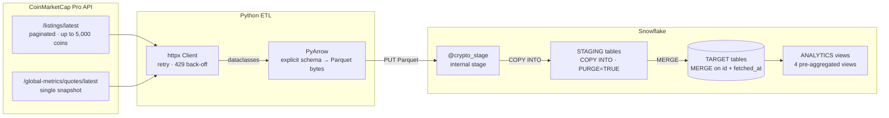

<div align="center">


<br/>


</div>

<br/>

> **Hypothetical Showcase** — demonstrates REST API ingestion, Parquet serialisation, and idempotent Snowflake loading. All credentials are environment-variable driven.

---

## ◈ Architecture



Both datasets — coin listings and global metrics — follow the same four-step pipeline: fetch → type-safe dataclasses → Parquet → stage-and-merge. Running the pipeline multiple times per day builds a historical series for trending.

---

## ◈ Tech Stack

<div align="center">


</div>

---

## ◈ Credentials

All secrets are injected via environment variables — no credentials in code or version control. See [CREDENTIALS.md](../CREDENTIALS.md) for Snowflake key-pair setup, Cloud Secrets Managers, and CI/CD patterns.

```bash
# .env (never committed — add *.env and *.p8 to .gitignore)
CMC_API_KEY=your-coinmarketcap-pro-api-key
SNOWFLAKE_ACCOUNT=xy12345.us-east-1
SNOWFLAKE_USER=etl_user
SNOWFLAKE_PRIVATE_KEY_PATH=/path/to/rsa_key.p8
SNOWFLAKE_ROLE=TRANSFORMER        # optional, default: TRANSFORMER
SNOWFLAKE_WAREHOUSE=CRYPTO_WH     # optional, default: CRYPTO_WH
SNOWFLAKE_DATABASE=CRYPTO         # optional, default: CRYPTO
```

The code uses `os.environ["KEY"]` throughout — missing credentials raise a `KeyError` at startup rather than producing a silent `None` five steps into the pipeline.

Snowflake uses **key-pair auth** over password: the private key can't be captured in query logs, rotates independently of password policy, and works cleanly in service account contexts.

---

## ◈ Quick Start

**Prerequisites:** Python 3.11+ · CoinMarketCap Pro API key · Snowflake account with key-pair auth

```bash
# 1. Create Snowflake objects (run once)
#    Execute sql/create_tables.sql in your Snowflake worksheet

# 2. Set environment variables
export CMC_API_KEY="your-coinmarketcap-pro-api-key"
export SNOWFLAKE_ACCOUNT="xy12345.us-east-1"
export SNOWFLAKE_USER="etl_user"
export SNOWFLAKE_PRIVATE_KEY_PATH="/path/to/rsa_key.p8"

# 3. Install and run
pip install -r requirements.txt
python main.py                   # top 500 coins + global metrics
python main.py --limit 5000      # full top-5,000 run
python main.py --no-global-metrics
```

---

## ◈ How It Works

### API Client — `src/coinmarketcap_client.py`

CMC caps listings at 5,000 rows per call. The client uses a `start`-offset pagination loop, incrementing by `batch_size` until `limit` coins are fetched or the API returns fewer rows than requested.

```python
# Auth via header — never query params (avoids server logs / browser history)
headers = {"X-CMC_PRO_API_KEY": os.environ["CMC_API_KEY"]}

# 429 handling — sleep exactly Retry-After seconds (preserves credit budget)
if response.status_code == 429:
    wait = int(response.headers.get("Retry-After", 60))
    time.sleep(wait)
```

Retries up to 4× on 5xx with exponential back-off: 2s → 4s → 8s → 16s.

### Schema & Serialisation — `src/transform.py`

Responses are mapped to typed Python dataclasses (`CoinListing`, `GlobalMetrics`) then serialised to Parquet via an **explicit PyArrow schema**. Without it, `pa.Table.from_pylist` infers types from the first row — a `None` price on coin #1 would infer `null` type and break all subsequent rows.

```python
LISTINGS_SCHEMA = pa.schema([
    ("id",             pa.int64()),
    ("symbol",         pa.string()),
    ("price_usd",      pa.float64()),
    ("market_cap_usd", pa.float64()),
    ("change_24h_pct", pa.float64()),
    ("fetched_at",     pa.timestamp("us", tz="UTC")),
    ...
])
```

### Snowflake Loader — `src/snowflake_loader.py`

The `_stage_and_merge` method handles all four steps atomically:

```sql
PUT file://buffer.parquet @crypto_stage;
COPY INTO cmc_listings_stage FROM @crypto_stage
    FILE_FORMAT = (TYPE = PARQUET MATCH_BY_COLUMN_NAME = CASE_INSENSITIVE)
    PURGE = TRUE;
MERGE INTO cmc_listings t USING cmc_listings_stage s
    ON t.id = s.id AND t.fetched_at = s.fetched_at
    WHEN MATCHED THEN UPDATE ...
    WHEN NOT MATCHED THEN INSERT ...;
TRUNCATE TABLE cmc_listings_stage;
```

`MERGE ON (id, fetched_at)` allows multiple daily snapshots while preventing duplicates on re-run. `CLUSTER BY DATE(FETCHED_AT)` on the target table enables micro-partition pruning for date-range queries.

---

## ◈ Data Model

| Table | Grain | Description |
|---|---|---|
| `CRYPTO.RAW.CMC_LISTINGS` | coin × snapshot | Price, volume, market cap, % changes (1h/24h/7d/30d), CMC rank |
| `CRYPTO.RAW.CMC_GLOBAL_METRICS` | snapshot | Total market cap, BTC/ETH dominance, active exchanges |

**Analytics views** — queryable immediately after load:

| View | Grain | Description |
|---|---|---|
| `ANALYTICS.DAILY_COIN_PRICES` | coin × date | Latest snapshot per coin per day — `QUALIFY ROW_NUMBER()` dedup |
| `ANALYTICS.CURRENT_TOP_10` | coin | Top 10 by CMC rank at latest fetch |
| `ANALYTICS.PRICE_HISTORY_7D` | coin × date | Daily OHLC + max volume, trailing 7 days |
| `ANALYTICS.BTC_DOMINANCE_TREND` | date | Daily avg BTC/ETH dominance, total market cap (trillions) |

```sql
-- 7-day Bitcoin price history
SELECT price_date, avg_price_usd, high_price_usd, low_price_usd
FROM CRYPTO.ANALYTICS.PRICE_HISTORY_7D
WHERE symbol = 'BTC'
ORDER BY price_date;
```

---

## ◈ Key Design Decisions

| Decision | Rationale |
|---|---|
| Header-based API auth | `X-CMC_PRO_API_KEY` doesn't appear in server logs or browser history |
| Respect `Retry-After` on 429 | CMC bills by credit; sleeping exactly the specified duration avoids burning retry credits |
| Explicit PyArrow schema | Prevents `None`-inferred null types from breaking Parquet serialisation on the first row |
| Parquet + `COPY INTO` | Snowflake's fastest ingest path; parallelises server-side; columnar encoding compresses float-heavy price data better than CSV |
| `MERGE ON (id, fetched_at)` | Allows multiple daily snapshots (hourly runs) while remaining idempotent — re-running the same batch is safe |
| `CLUSTER BY DATE(FETCHED_AT)` | Micro-partition pruning: `WHERE fetched_at >= ...` scans only relevant partitions |

---

---

<div align="center">

<a href="https://www.linkedin.com/in/derek-o-halloran/">
  
</a>&nbsp;
<a href="https://github.com/ohderek/data-engineering-portfolio">
  
</a>

<br/><br/>


</div>
