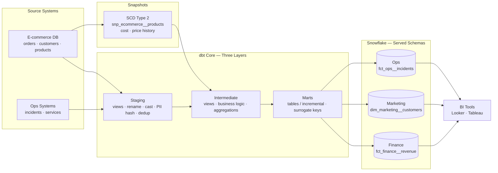

<div align="center">


<br/>


</div>

<br/>

> **Hypothetical Showcase** — production-grade dbt project demonstrating analytics engineering best practices on Snowflake. Every design decision is explained with the reasoning behind it.

---

## ◈ Architecture



E-commerce and ops source data flows through three strictly-separated dbt layers into domain-organised Snowflake schemas. The `generate_schema_name` macro ensures dev runs land in isolated sandboxes, never touching production.

---

## ◈ Quick Start

**Prerequisites:** Python 3.9+ · `dbt-snowflake` · Snowflake account with key-pair auth

```bash
pip install dbt-snowflake

# Configure ~/.dbt/profiles.yml (see profiles.yml in this repo)
dbt deps                              # install dbt_utils, dbt_project_evaluator

dbt source freshness                  # gate: check raw data isn't stale

dbt build                             # run + test, respecting dependency order

# Targeted runs
dbt run --select +fct_finance__revenue   # model + all upstream
dbt run --select fct_finance__revenue+   # model + all downstream
dbt run --full-refresh --select fct_finance__revenue

dbt snapshot                          # run SCD2 snapshots
dbt docs generate && dbt docs serve   # interactive DAG + data dictionary
```

---

## ◈ Layer 1 — Staging

Staging models are thin wrappers over raw source tables. **Single responsibility**: make the data safe and consistent to build on. Nothing more.

Every model follows the **four-CTE pattern**:

```sql
-- stg_ecommerce__orders.sql
with
source      as (select * from {{ source("ecommerce", "orders") }}),
renamed     as (
    select
        order_id,
        lower(trim(status))              as status,
        total_amount::float              as total_amount,
        created_at::timestamp_ntz        as created_at,
        (status = 'completed')::boolean  as is_completed
    from source
    where not coalesce(_is_deleted, false)
),
deduplicated as (
    select *, row_number() over (partition by order_id order by updated_at desc) as _row_num
    from renamed
),
final as (select * from deduplicated where _row_num = 1)

select * from final
```

**PII hashed at the boundary** — raw values never propagate downstream:

```sql
{{ hash_pii('email') }} as email_hash   -- sha2(lower(trim(email)), 256)
```

**Materialization: view** — staging is only queried during dbt runs, never by analysts. No reason to materialise as a table.

---

## ◈ Layer 2 — Intermediate

Business logic lives here — never in staging, never in marts. Only `ref()` other models; no `source()` calls.

`int_ecommerce__customer_orders.sql` produces the customer behavioural attributes used by `dim_marketing__customers`:

```sql
aggregated as (
    select
        customer_id,
        count(*)                                          as total_orders,
        sum(case when is_completed then total_amount end) as lifetime_revenue,
        div0(count_if(is_refunded), count_if(is_completed)) as refund_rate,
        case
            when total_orders >= 10 and lifetime_revenue >= 1000 then 'champion'
            when total_orders >= 5  and lifetime_revenue >= 500  then 'loyal'
            when total_orders >= 2                                then 'repeat'
            else 'one_time'
        end as order_tier,
        (datediff('day', last_order_date, current_date()) >= 90)::boolean as is_churned
    from orders
    group by customer_id
)
```

---

## ◈ Layer 3 — Marts

Analyst-facing tables, organised by **business domain** — not by source system.

### Fact Table: `fct_finance__revenue`

```sql
{{ config(
    materialized          = "incremental",
    incremental_strategy  = "merge",
    unique_key            = ["order_item_id", "order_date"],
    cluster_by            = ["order_date"],
    on_schema_change      = "append_new_columns",
    incremental_predicates = [
        "DBT_INTERNAL_DEST.order_date >= dateadd(day, -{{ var('data_interval_lookback_days') }}, current_date())"
    ],
    snowflake_warehouse = ("ETL__LARGE" if is_incremental() else "ETL__XLARGE"),
    persist_docs = { "relation": true, "columns": true },
) }}
```

| Decision | Rationale |
|---|---|
| Composite `unique_key (order_item_id, order_date)` | Enables Snowflake micro-partition pruning during MERGE — scans only matching date partitions |
| `incremental_predicates` | Adds `WHERE` clause to the *target side* of MERGE — 99%+ scan reduction on billion-row tables |
| `on_schema_change = "append_new_columns"` | New columns added automatically; avoids `--full-refresh` on every schema change |
| `ETL__LARGE` vs `ETL__XLARGE` | Incremental runs process small result sets; full refreshes need the larger warehouse. Right-size compute to work done. |

### Dimension: `dim_marketing__customers`

Fully denormalised — all customer context in one table. An analyst querying revenue by segment never joins anything. BI tool performance depends on this.

### Surrogate Keys

```sql
{{ dbt_utils.generate_surrogate_key(['oi.order_item_id', 'o.order_date']) }} as revenue_pk
```

MD5 hash of natural key columns. Stable across source migrations, database-agnostic, deterministic on replay.

---

## ◈ Snapshots — SCD Type 2

Without SCD2, a product's March cost change would retroactively corrupt February margin calculations.

```sql

    {{ config(
        target_schema = "snapshots",
        unique_key    = "product_id",
        strategy      = "check",
        check_cols    = ["product_name", "cost_price", "is_active"],
    ) }}
    select * from {{ ref("stg_ecommerce__products") }}

```

Snapshotting the **staging** model (not the raw source) prevents noise changes — whitespace, cast differences — from being recorded as meaningful SCD events.

---

## ◈ Testing Strategy

```yaml
# Generic tests — declared inline with column descriptions
- name: fct_finance__revenue
  data_tests:
    - dbt_utils.expression_is_true:
        expression: "net_line_amount <= gross_line_amount"
        where: "order_date >= dateadd('day', -30, current_date())"
```

```sql
-- Singular test — any returned row is a failure
-- tests/assert_net_revenue_not_exceeds_gross.sql
select order_item_id, gross_line_amount, net_line_amount
from {{ ref("fct_finance__revenue") }}
where net_line_amount > gross_line_amount
  and order_date >= dateadd('day', -30, current_date())
```

**Test severity:** most tests are `warn` (bad rows don't block the pipeline). Surrogate key uniqueness and critical business constraints are `error`.

### CI/CD — Slim CI with `--defer`

```yaml
# .github/workflows/dbt_ci.yml
- name: dbt build
  run: |
    dbt build \
      --target ci \
      --vars '{"dbt_project_evaluator_enabled": true}' \
      --defer \
      --state ./prod-artifacts
```

`--defer --state`: models unchanged from production are not rebuilt. CI only runs what changed in the PR plus downstream dependants — fast and focused.

---

## ◈ Macros

| Macro | What it does |
|---|---|
| `generate_schema_name` | `prod`: clean schema names. `dev`: `sandbox_{user}_` isolation. `ci`: mirrors production. |
| `hash_pii` | `sha2(lower(trim(col)), 256)` — one place to update the algorithm |
| `safe_divide` | `IFF(denominator = 0, NULL, numerator / denominator)` |

---

## ◈ Tech Stack

<div align="center">


</div>

---

<div align="center">

<a href="https://www.linkedin.com/in/derek-o-halloran/">
  
</a>&nbsp;
<a href="https://github.com/ohderek/data-engineering-portfolio">
  
</a>

<br/><br/>


</div>
