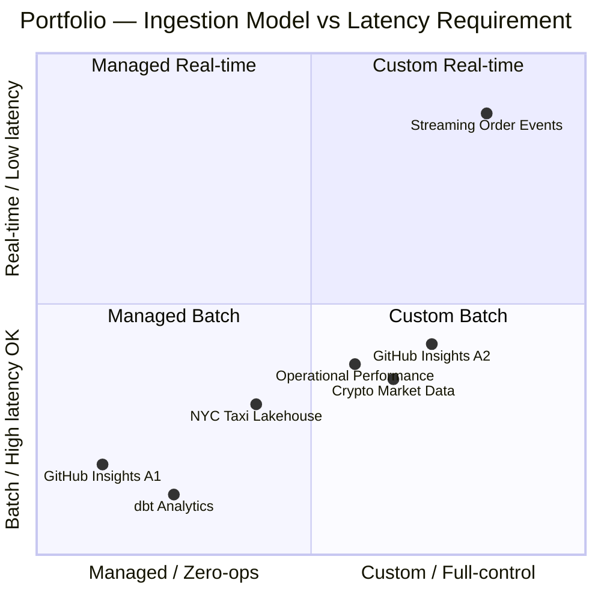
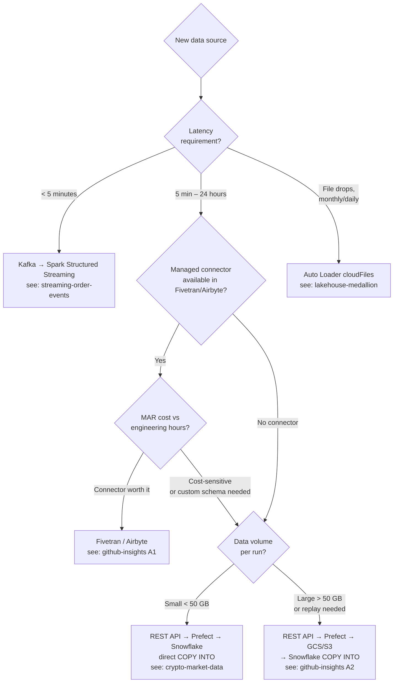
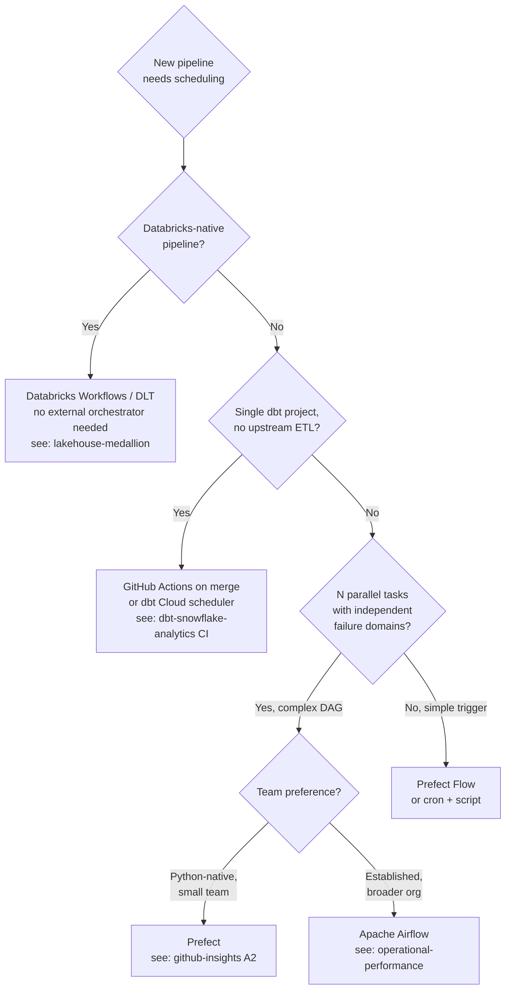
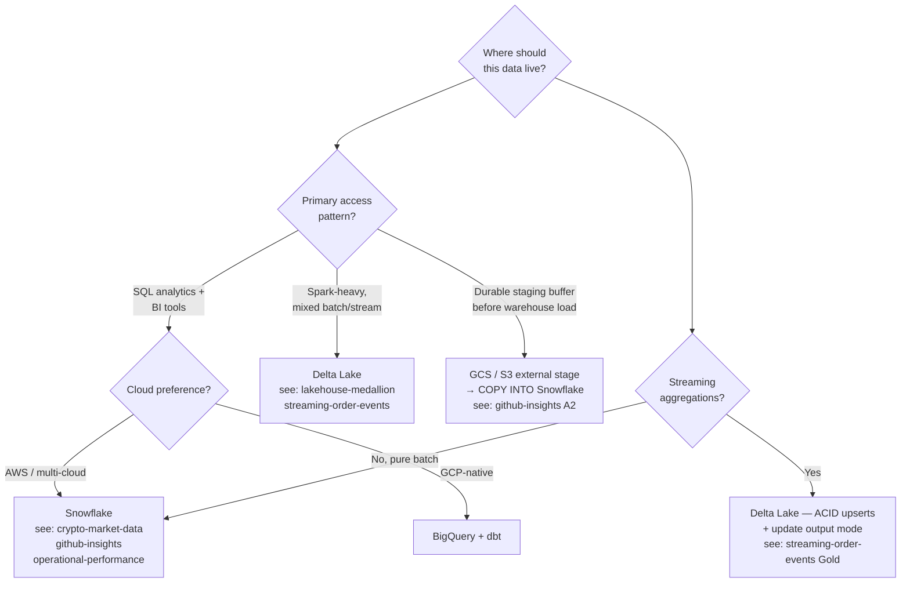
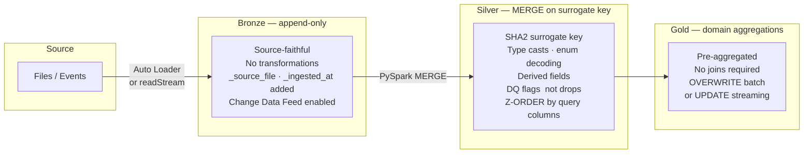
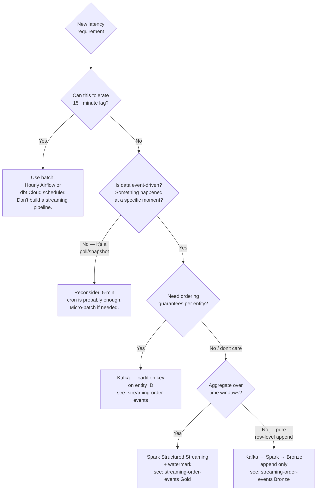

<div align="center">


<br/>


</div>

<br/>

> Grounded in the six projects in this portfolio. Every principle links to a concrete implementation — not theory, not vendor documentation.

---

## ◈ Philosophy — The Four Principles

Four non-negotiable properties of every production pipeline in this portfolio. Every section below enforces at least one of them.

**1. Schema-first, always.** An explicit schema is a contract between producer and consumer. Without it, `None` on row 1 infers `null` type and poisons every subsequent row in the Parquet file. The explicit PyArrow `StructType` in [`crypto-market-data`](./crypto-market-data) and [`lakehouse-medallion`](./lakehouse-medallion) is not defensive programming — it is the minimum viable approach for any pipeline that runs unattended.

**2. Idempotent by default.** Running a pipeline N times must produce the same result as running it once. If re-running requires manual row deletion or a "did it already run?" check, the pipeline is not production-ready. Every project in this portfolio is idempotent by design — see the cross-reference table below.

**3. Fail loudly, early.** `os.environ["KEY"]` raises `KeyError` at startup. `os.environ.get("KEY")` returns `None` silently and fails six steps later with a confusing stack trace. DQ gates run before loads, not after. `dbt source freshness` runs before models. Bad data rejected at the boundary is cheaper than bad data discovered in a dashboard.

**4. Right-size compute to work done.** `ETL__LARGE` for incremental runs, `ETL__XLARGE` for full refresh. 30-second Spark micro-batches at 5 events/sec. Hourly Airflow for batch sources that update hourly. Streaming only when latency genuinely requires it. The right amount of compute is the minimum needed — not the maximum available.

### Where Each Project Sits



### Cross-Reference: Principle → Project

| Principle | crypto | ops-perf | gh A1 | gh A2 | lakehouse | dbt | streaming |
|---|:---:|:---:|:---:|:---:|:---:|:---:|:---:|
| Explicit schema | ✓ | | | ✓ | ✓ | ✓ | ✓ |
| Idempotent MERGE / checkpoint | ✓ | ✓ | | ✓ | ✓ | ✓ | ✓ |
| Fail-fast `os.environ[]` | ✓ | ✓ | | ✓ | | ✓ | |
| Rate-limit / retry handling | ✓ | ✓ | | | | | |
| Per-source watermark | | ✓ | | ✓ | | ✓ | ✓ |
| SCD Type 2 user dimension | | | ✓ | ✓ | | ✓ | |
| Incremental predicates | | ✓ | | | | ✓ | |
| Soft DQ flags (never drop) | | | | | ✓ | | |
| Event-time windowing | | | | | | | ✓ |
| Slim CI (`--defer`) | | | | | | ✓ | |

---

## ◈ Ingestion — How Data Enters the System

The highest-leverage architectural decision. The wrong ingestion pattern propagates cost and complexity into every downstream layer.

### Decision Tree



### Pattern Comparison

| Pattern | Project | Use when | Avoid when |
|---|---|---|---|
| **Fivetran managed sync** | github-insights A1 | Connector exists · schema drift expected · ops overhead unacceptable | Cost-sensitive at scale (MAR pricing) · sub-hourly latency · custom schema required |
| **REST API → direct COPY INTO** | crypto-market-data | No connector · < 50 GB/run · minimal staging needed | High volume (stage in object store first) · sub-minute latency |
| **REST API → GCS/S3 → COPY INTO** | github-insights A2 | Volume justifies staging · replay capability needed · decouple ingest from load | Small payloads (adds GCS/S3 complexity without benefit) |
| **Auto Loader (cloudFiles)** | lakehouse-medallion | File-based sources · Databricks-native · monthly/daily drops | Non-file sources · non-Databricks environments |
| **Kafka → Structured Streaming** | streaming-order-events | Event-driven · < 5 min latency · ordering per entity matters | Batch sources · simple scheduled pulls · no streaming infrastructure |
| **Multiple APIs → Airflow** | operational-performance | N sources with different schedules · parallel extraction · per-source watermarks | Single source (Airflow overhead not justified) |

### API Client Patterns

**Rate-limit handling** — respect `Retry-After` exactly. Do not guess, do not add padding:
```python
if response.status_code == 429:
    wait = int(response.headers.get("Retry-After", 60))
    time.sleep(wait)                  # exact sleep — over-sleeping burns nothing
# Exponential back-off on 5xx: 2s → 4s → 8s → 16s (max 4 attempts)
```

**Auth via header, not query param** — query params appear in server logs and browser history:
```python
headers = {"X-CMC_PRO_API_KEY": os.environ["CMC_API_KEY"]}  # correct
# NOT: params={"apikey": key}  — never query params for credentials
```

**Per-source watermarks** — a failure in one source must not reset all others:
```python
# Each source tracks its own last_updated_at independently
# Stored in Airflow Variable or a metadata table, not hardcoded
watermark = Variable.get(f"watermark_{source_name}", default_var="2020-01-01")
records = api.fetch_since(watermark)
# After successful load, advance the watermark
Variable.set(f"watermark_{source_name}", max_updated_at)
```

**Fivetran vs custom — the real trade-off:** the [`github-insights`](./github-insights) project implements both deliberately. Approach 1 (Fivetran) and Approach 2 (custom Prefect flow) produce identically-structured raw tables — all dbt downstream code is shared. The fork is purely operational. Custom is not "more impressive" — it is appropriate under specific cost and latency constraints.

---

## ◈ Serialisation — The Transit Format

A micro-decision with macro consequences. Wrong format causes silent type drift, slow loads, or irreproducible pipelines.

### Format Decision

| Format | Use when | Avoid when | Portfolio example |
|---|---|---|---|
| **Parquet (PyArrow)** | Columnar analytics · float-heavy · Snowflake COPY INTO · schema portability | Single-row API responses · quick prototypes | crypto-market-data, github-insights A2 |
| **JSON** | Kafka wire format · schema unknown at write time · streaming payloads | Long-term storage · analytics queries | streaming-order-events (Kafka) |
| **Delta Lake** | ACID upserts · time travel · Spark-native · streaming writes | Snowflake-only shops · simple pipelines | lakehouse-medallion, streaming-order-events |
| **CSV** | Never in production pipelines | Everything | — |

### Why Explicit Schema Always Wins

Without explicit schema, `pa.Table.from_pylist` infers type from the first row. One `None` on row 1 infers `null` type — every subsequent row with a real value fails:

```python
# Bad — type inference
table = pa.Table.from_pylist(records)  # row 1: price=None → infers null → row 2 fails

# Good — explicit schema
LISTINGS_SCHEMA = pa.schema([
    pa.field("id",             pa.int64()),
    pa.field("price_usd",      pa.float64()),   # None on row 1 → null float64, valid
    pa.field("market_cap_usd", pa.float64()),
    pa.field("fetched_at",     pa.timestamp("us", tz="UTC")),
])
table = pa.Table.from_pylist(records, schema=LISTINGS_SCHEMA)
```

The same principle applies to PySpark: declare `StructType` explicitly in [`lakehouse-medallion`](./lakehouse-medallion) rather than relying on `inferSchema=True`, which reads every file in the source directory on startup — expensive at scale and fragile on type changes.

**Parquet as the standard transit format:**
- Columnar encoding compresses float-heavy price data significantly better than CSV
- Snowflake's `COPY INTO` parallelises Parquet loads server-side — the fastest ingest path
- Same file readable by Spark, DuckDB, BigQuery, Snowflake — no engine lock-in
- `pa.BufferOutputStream()` writes to a memory buffer; PUT to Snowflake stage without touching disk — no temp file cleanup

---

## ◈ Orchestration — Airflow vs Prefect vs Neither

### Decision Tree



### Airflow vs Prefect

| Dimension | Airflow | Prefect |
|---|---|---|
| **DAG definition** | Python with framework constraints | Pure Python functions + decorators |
| **Ops overhead** | High (Celery/K8s executor, metadata DB, scheduler) | Low (managed cloud or lightweight server) |
| **Parallel task isolation** | `TaskGroup` with independent retries | Subflows + `task.map()` |
| **Secrets management** | Connections + Variables + Secrets Backend | Blocks (Secret, GCS, Snowflake) |
| **Local dev** | `airflow standalone` (heavy) | `prefect server start` (lightweight) |
| **When to choose** | Large data org · established Airflow · complex cross-DAG dependencies | New project · small team · Python-first culture · simpler operational model |

**The DAG parse-time vs execution-time trap:** in Airflow, code at the DAG level executes on every scheduler heartbeat (~every 30s). `Variable.get()` calls at the DAG level make a metadata DB query every 30 seconds — exhausts the connection pool at scale and leaks secrets into scheduler logs. Always fetch secrets inside `@task` functions (execution time), never at the DAG definition level.

```python
# Bad — fetched at parse time, runs every 30s
API_KEY = Variable.get("INCIDENT_IO_API_KEY")  # at module level

# Good — fetched at execution time, once per task run
@task
def extract_incidents():
    api_key = Variable.get("INCIDENT_IO_API_KEY")  # inside the task
```

**When NOT to use an orchestrator:**
- Single dbt project: `dbt build` in GitHub Actions is sufficient — no Airflow overhead
- Databricks pipelines: DLT + Databricks Workflows is the native stack; an external orchestrator just adds a failure surface and latency
- Streaming: Kafka + Spark Structured Streaming is self-orchestrating via checkpoint — Airflow scheduling a streaming job is a category error

---

## ◈ Storage — Warehouse vs Lakehouse vs Object Store

### Decision Tree



### Snowflake Loading Patterns

All three patterns are idempotent — re-running produces no duplicates:

| Pattern | SQL / SDK | Use case | Project |
|---|---|---|---|
| PUT → COPY INTO → MERGE → TRUNCATE stage | Four-step atomic | Daily/hourly snapshots; multiple snapshots per day | crypto-market-data |
| External GCS/S3 stage → COPY INTO → MERGE | Via STORAGE_INTEGRATION | High volume; decouple ingest from load; replay from object store | github-insights A2 |
| `write_pandas` → staging → MERGE INTO target | Snowflake Python SDK | Multi-source ETL with Python transformation layer | operational-performance |

**The clustering decision** is not premature optimisation — it is the correct default for any time-series fact table:
```sql
CREATE TABLE cmc_listings (...)
CLUSTER BY (DATE(fetched_at));  -- micro-partition pruning on date-range queries
```
`WHERE fetched_at >= DATEADD('day', -30, CURRENT_DATE())` scans only relevant partitions instead of the full table. Apply `CLUSTER BY (date_column)` to every fact table at creation time.

### Delta Lake — Medallion Layer Contracts



**Why soft DQ failures (flag, don't drop):** hard drops in Silver hide data quality problems. `dq_valid = false` + `dq_flags` array means analysts choose inclusion/exclusion. The failure breakdown is always queryable — `LATERAL VIEW explode(dq_flags)` shows the distribution. A Silver table with flagged rows is transparent; a Silver table with silently dropped rows is corrupted.

**Z-ORDER** — `OPTIMIZE taxi_lakehouse.silver.trips ZORDER BY (pu_location_id, pickup_datetime)` co-locates rows with the same location on the same files. Queries filtering by location (the most common pattern) skip entire file groups — 60–80% scan reduction on a 12-month dataset. Apply Z-ORDER to the columns that appear most frequently in `WHERE` and `JOIN` clauses.

**Object store as transit, not archive:** GCS/S3 in this portfolio is a staging layer between ingestion and warehouse load, not a long-term data lake. The value: decouples ingestion compute from warehouse loading, and enables replay — if Snowflake `COPY INTO` fails, the Parquet files remain in GCS. Re-run `COPY INTO` against the same files; no API re-fetch required.

---

## ◈ Transformation — dbt Layer Design

### The Three-Layer Model

```mermaid
flowchart LR
    SRC["source()"] -->|only allowed in| STG

    subgraph STG["Staging  stg_"]
        direction TB
        s1["rename · cast\nPII hash · dedup\nMaterialised: view"]
    end

    subgraph INT["Intermediate  int_"]
        direction TB
        i1["business logic\nJinja loops · joins\nMaterialised: view"]
    end

    subgraph MART["Marts  fct_ · dim_ · bridge_"]
        direction TB
        m1["analyst-facing\nsurrogate keys · incremental\nMaterialised: table / incremental"]
    end

    subgraph SNAP["Snapshots  snp_"]
        direction TB
        sn1["SCD Type 2\nfrom staging only"]
    end

    STG -->|ref() only| INT
    STG -->|ref() only| SNAP
    INT -->|ref() only| MART
    MART --> BI["BI Tools\nAnalysts"]
```

**Strict directional rules (enforced by `dbt_project_evaluator` in CI):**
- Staging: `source()` allowed; no business logic; no joins between staging models
- Intermediate: `ref()` only; no `source()` calls; all business logic lives here
- Marts: `ref()` only; analyst-facing; always materialised as table or incremental
- Snapshots: `ref()` staging models only — never raw source (avoids noise changes triggering spurious SCD events)

### Staging — The Four-CTE Pattern

Every staging model in this portfolio follows this structure:

```sql
with
source as (
    select * from {{ source("ecommerce", "orders") }}  -- always source(), never raw table
),
renamed as (
    select
        order_id,
        lower(trim(status))               as status,
        total_amount::float               as total_amount,
        created_at::timestamp_ntz         as created_at,
        (status = 'completed')::boolean   as is_completed,   -- boolean flag at staging
        {{ hash_pii('email') }}           as email_hash      -- PII hashed here, never downstream
    from source
    where not coalesce(_is_deleted, false)
),
deduplicated as (
    select *,
        row_number() over (
            partition by order_id
            order by updated_at desc, data_synced_at desc
        ) as _row_num
    from renamed
),
final as (select * from deduplicated where _row_num = 1)

select * from final
```

The terminal `select * from final` is deliberate — insert a new CTE anywhere in the chain without editing the last line.

**Deduplication at the boundary:** source systems emit duplicates on replication. Deduplicating at staging means every downstream model gets clean input. If deduplication lives in an intermediate model, the noise propagates further and is harder to reason about.

**PII hashed at the boundary:** `{{ hash_pii('email') }}` calls `sha2(lower(trim(email)), 256)`. One macro, one algorithm to update. Raw PII never propagates to intermediate or marts — enforced by convention at the model boundary.

### Intermediate — The Jinja Loop Pattern

The key reuse pattern in [`operational-performance`](./operational-performance). Adding a fourth workspace is one line:

```sql
-- int_ops__incidents_unioned.sql



    SELECT *, '{{ instance }}' AS workspace
    FROM {{ ref('stg_incident_io__' ~ instance ~ '__incidents') }}
     UNION ALL 

```

Three workspaces → four is `['companya', 'companyb', 'companyc', 'companyd']`. The SQL generates itself. This is the correct abstraction for N-source union patterns — not copy-pasting SQL blocks that diverge silently over time.

### Marts — The Incremental Predicates Pattern

The single most impactful performance optimisation available in dbt + Snowflake. Without it, `dbt MERGE` scans the entire destination table on every run. With it, the scan is restricted to recent partitions:

```sql
{{ config(
    materialized          = "incremental",
    incremental_strategy  = "merge",
    unique_key            = ["order_item_id", "order_date"],
    cluster_by            = ["order_date"],
    incremental_predicates = [
        "DBT_INTERNAL_DEST.order_date >= dateadd(day, -{{ var('data_interval_lookback_days') }}, current_date())"
    ],
    snowflake_warehouse = ("ETL__LARGE" if is_incremental() else "ETL__XLARGE"),
) }}
```

On a billion-row fact table, `incremental_predicates` reduces the MERGE scan by 99%+. The `var('data_interval_lookback_days')` is the lookback buffer — wider than the maximum expected late-arrival window for source data. Both [`dbt-snowflake-analytics`](./dbt-snowflake-analytics) and [`operational-performance`](./operational-performance) use 7 days: incidents are updated days after resolution; orders can have late payment status updates.

**Composite `unique_key` enables partition pruning on the target side of the MERGE.** `["order_item_id", "order_date"]` — the date component allows Snowflake to skip partitions that can't contain matching rows. Natural key alone (`order_item_id`) forces a full scan regardless of `incremental_predicates`.

### SCD Type 2 — When Attribution Breaks Without It

```
Without SCD2:
  February  — Engineer A is on Team Frontend. Merges PR #100.
  March     — Engineer A transfers to Team Platform.
  Query today: "PRs by team in February" → PR #100 attributed to Team Platform.
  WRONG — it was a Frontend PR.

With SCD2 in dim_github__users:
  row 1: ldap=eng_a, team=Frontend, effective_start=Jan 1, effective_end=Mar 1, is_current=false
  row 2: ldap=eng_a, team=Platform,  effective_start=Mar 1, effective_end=null,  is_current=true

  February query joins:
    WHERE dim_users.ldap = fact.user_ldap
      AND dim_users.effective_start <= fact.pr_created_at
      AND (dim_users.effective_end > fact.pr_created_at OR dim_users.effective_end IS NULL)
  → Matches row 1. Attribution: Frontend. CORRECT.
```

**When to snapshot staging, not source:** `snp_ecommerce__products` snapshots the staging model. Raw source snapshots capture noise — whitespace changes, type cast differences — as meaningful SCD events. Every apparent change in the snapshot should represent a real business change.

### Testing — Severity Matters

| Test | Severity | Why |
|---|---|---|
| Surrogate key `unique` | `error` — blocks run | Silent duplicates corrupt every downstream aggregate |
| Source `not_null` on PKs | `error` | Null PK means a broken upstream load |
| `dbt source freshness` | `error` (pre-run gate) | Transforming stale data creates confidently wrong marts |
| Business constraint (`net <= gross`) | `error` on mart, `warn` on source | Corrupted source shouldn't block all models |
| Row count anomaly (>20% variance) | `warn` | Alert without blocking; investigate before escalating |
| Referential integrity (FK joins) | `warn` | Source FK violations are common; block on mart FK issues |

**Slim CI — `--defer --state`:** unchanged models are not rebuilt; CI uses production tables instead. On a 200-model project, a single-model PR change takes 3 minutes instead of 45:

```bash
dbt build --target ci --defer --state ./prod-artifacts \
  --vars '{"dbt_project_evaluator_enabled": true}'
```

`dbt_project_evaluator` enforces governance automatically: models without tests, missing documentation, staging models that `ref()` other staging models, marts that call `source()` directly. Convention enforced by CI, not by code review.

---

## ◈ Streaming — When Batch Isn't Enough

Most data engineering work is batch. This section defines the exact conditions that justify streaming complexity.

### Decision Tree



### Event Time vs Processing Time — The Most Common Streaming Bug

**Processing time windowing** assigns events to windows based on when Spark processes them. A network hiccup at 14:03 delays a batch of orders; they arrive at Spark at 14:11 but were placed at 14:02. They land in the wrong window. Revenue figures shift based on network conditions, not business reality.

**Event time windowing** (the approach in [`streaming-order-events`](./streaming-order-events)) assigns events based on `event_timestamp` in the payload — the moment the order was placed. The delayed batch from 14:02 arrives at 14:11 and is correctly assigned to the 14:00–14:05 window, regardless of network delays.

```python
# Event time drives window assignment — not Kafka arrival time
.withWatermark("event_timestamp", "10 minutes")   # payload timestamp
.groupBy(F.window("event_timestamp", "5 minutes"), "region")
```

### Watermarking — The Memory-Completeness Trade-off

| Watermark | Memory | Late data accepted | Use when |
|---|---|---|---|
| 1 minute | Minimal | Events < 1 min late | Highly reliable producers, same-DC |
| 10 minutes | Moderate | Events < 10 min late | Default for most e-commerce (streaming-order-events) |
| 1 hour | High | Mobile app offline batching | Mobile-first, unreliable network |
| None | Unbounded — OOM risk | All late data accepted | Never in production |

Windows are not finalised until the watermark passes `window_end`. At 10 minutes: a 14:00–14:05 window stays open until ~14:15. Size the watermark to the 99th percentile of expected producer delay, not the worst case.

### Output Modes

| Mode | Delta behaviour | Use when | Avoid when |
|---|---|---|---|
| `append` | New rows only | Raw event capture, no aggregations | Aggregations (produces duplicate window rows) |
| `update` | Changed rows only (Delta MERGE) | Windowed aggregations — efficient | Sinks without upsert capability |
| `complete` | Entire result rewritten | Small top-N aggregations | Large aggregations (rewrites everything every batch) |

[`streaming-order-events`](./streaming-order-events) uses `append` for Bronze (every raw event) and `update` for Gold (only the 5-min windows that changed in this batch). This combination is the correct default for Bronze + aggregation Gold architectures.

### Exactly-Once via Checkpoint + Delta

Spark commits the Kafka offset to `./checkpoints/` after each successful micro-batch write. Delta Lake writes are atomic. On failure and restart:

1. Spark reads the checkpoint — still pointing to offset N-1
2. Re-reads messages from offset N (exactly the same batch)
3. Writes to Delta — succeeds
4. Checkpoint advances to offset N

No coordinator, no two-phase commit, no external transaction manager. Exactly-once semantics from two local mechanisms: the checkpoint file and Delta's atomic write.

---

## ◈ Pipeline Design Principles

Technology-agnostic. These apply regardless of which tool appears in the sections above.

### Idempotency — By Layer

| Layer | Mechanism | Project |
|---|---|---|
| API extraction | Watermark-based pull (`updated_at > last_watermark`) | operational-performance |
| Snowflake COPY + MERGE | `MERGE ON (natural_key, date)` | crypto-market-data |
| Delta Silver | `MERGE ON sha2_surrogate_key` | lakehouse-medallion |
| dbt incremental | `merge` strategy + `unique_key` | dbt-snowflake-analytics |
| dbt snapshot | `check` strategy on staging model | dbt-snowflake-analytics |
| Streaming Bronze | `append` + Kafka offset checkpoint | streaming-order-events |
| Streaming Gold | `update` mode + checkpoint + Delta upsert | streaming-order-events |

**The idempotency test:** can you re-run this pipeline right now, safely, without manual intervention? If the answer is "we'd need to delete rows first" or "we need to check if it already ran", the pipeline is not production-ready.

### Schema Evolution — Safe vs Breaking

| Change | Safe? | Action |
|---|---|---|
| Add nullable column | ✓ Safe | `on_schema_change = "append_new_columns"` in dbt; `SCHEMA_EVOLUTION_MODE=addNewColumns` in Auto Loader |
| Widen type (int → bigint) | ✓ Usually safe | Verify no implicit casts break downstream |
| Rename column | ✗ Breaking | Rename in source + staging + all refs simultaneously, or deprecate old + add new |
| Narrow type (float → int) | ✗ Breaking (data loss) | Treat as rename |
| Drop column | ✗ Breaking | Deprecate: add `is_deleted` flag, keep column for N releases |
| Change string → timestamp | ✗ Breaking | New column + migration + deprecation |

**Alert, don't fail, on new nullable columns.** Log schema drift loudly (structured log, Slack alert). Do not silently accept additions — the next change might be breaking. But do not fail the pipeline on a harmless new column — that breaks SLA for a non-critical change.

### The Dual-Safety Pattern for Batch Ingestion

Both mechanisms are necessary. Neither alone is sufficient:

```
Watermark-based incremental pull
  → Catches all new records since last run
  → Does NOT catch backdated updates to already-ingested records

dbt 7-day lookback buffer
  → Catches late updates to already-ingested records
  → Does NOT catch new records missed by a watermark reset

Both together → complete coverage of new records AND late updates
```

### Dead-Letter / Quarantine — Never Drop Silently

**Soft flag pattern (lakehouse-medallion):**
```python
# DQ violations flagged, not dropped
df = df.withColumn("dq_valid", all_rules_pass_expr)
df = df.withColumn("dq_flags", flagged_violations_array)
# Silver keeps all rows. Gold filters: WHERE dq_valid = TRUE
# Analysts query WHERE dq_valid = FALSE to audit failure distribution
```

**DLT quarantine pattern:**
```python
@dlt.expect_all_or_drop({
    "valid_duration": "trip_duration_minutes > 0 AND trip_duration_minutes <= 1440",
    "valid_fare":     "fare_amount >= 0 AND fare_amount <= 1000",
})
```
Violations tracked in the DLT event log. The pipeline does not stop. The data is auditable.

**The rule:** a dropped row is untrackable data loss. A flagged row is an auditable quality issue. Always flag; never silently drop.

### Observability Checklist

Every production pipeline should emit these signals:

| Signal | Measure | Mechanism |
|---|---|---|
| Row counts | `rows_extracted`, `rows_loaded`, `rows_rejected` per run | Structured log with JSON handler |
| Pipeline metadata | `source`, `run_id`, `watermark_start`, `watermark_end`, `status` | Airflow task metadata / Prefect state |
| Data freshness | `MAX(updated_at)` vs `CURRENT_TIMESTAMP` | `dbt source freshness` as pre-run gate |
| Anomaly detection | Today's row count vs 7-day average (flag > 20% variance) | dbt singular test or custom assertion |
| Compute cost | Credits consumed per pipeline run | `SNOWFLAKE.ACCOUNT_USAGE.QUERY_HISTORY` |
| Streaming lag | Kafka consumer group lag (offset behind producer) | Kafka UI / Confluent Cloud metrics |

---

## ◈ Infrastructure and CI/CD

### Docker — Local Parity

Every project that can run locally ships with a `docker-compose.yml` and a `Makefile`. The developer experience for [`streaming-order-events`](./streaming-order-events) is three commands:

```bash
make start    # Kafka broker + Kafka UI on :8080
make produce  # 5 events/sec order stream
make consume  # Spark Structured Streaming job
```

Local Docker eliminates "works on my machine." The same `docker-compose.yml` that a new team member runs on their laptop runs in CI. Port conflicts aside, the environment is identical.

### dbt CI — The Four Steps

```yaml
steps:
  - run: dbt deps                                     # install packages
  - run: dbt source freshness                         # gate: raw data isn't stale
  - run: |
      dbt build \
        --target ci \
        --defer --state ./prod-artifacts \            # only run what changed
        --vars '{"dbt_project_evaluator_enabled": true}'  # enforce governance
```

`dbt_project_evaluator` catches structural violations automatically — models without documentation, marts calling `source()` directly, staging models referencing other staging models. Caught in CI at PR time; never reaches production.

### Terraform — Infrastructure as Code

Snowflake warehouses, databases, roles, and stages in Terraform. GCP service accounts and IAM bindings for `STORAGE_INTEGRATION` in Terraform. Databricks workspace config and Unity Catalog structure in Terraform.

The rule: if it was created by clicking in a UI, it cannot be reproduced reliably. Infrastructure that cannot be recreated from code is not production infrastructure — it is a manually-maintained liability.

### Credential Management

See [`CREDENTIALS.md`](./CREDENTIALS.md) for the full reference. The single governing principle:

```
Developer laptop  → .env file (gitignored) → os.environ["KEY"]
GitHub Actions    → Repository Secrets     → ${{ secrets.KEY }} → base64-decoded key file
Airflow           → Connections + Variables → fetched at task execution time, not parse time
Prefect           → Secret Blocks          → fetched at flow runtime, never logged
Databricks        → Secrets scope          → dbutils.secrets.get(), not env vars on shared compute
```

Passwords never appear in Snowflake connection config. Key-pair authentication (`rsa_key.p8`) is the standard across all projects — the private key path is the env var, never the key contents.

---

<div align="center">

<a href="https://www.linkedin.com/in/derek-o-halloran/">
  
</a>&nbsp;
<a href="https://github.com/ohderek/data-engineering-portfolio">
  
</a>&nbsp;
<a href="./CREDENTIALS.md">
  
</a>

<br/><br/>


</div>
