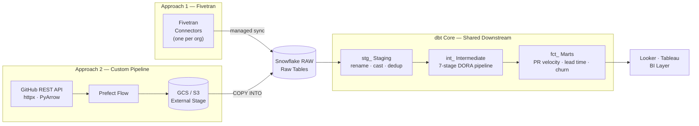
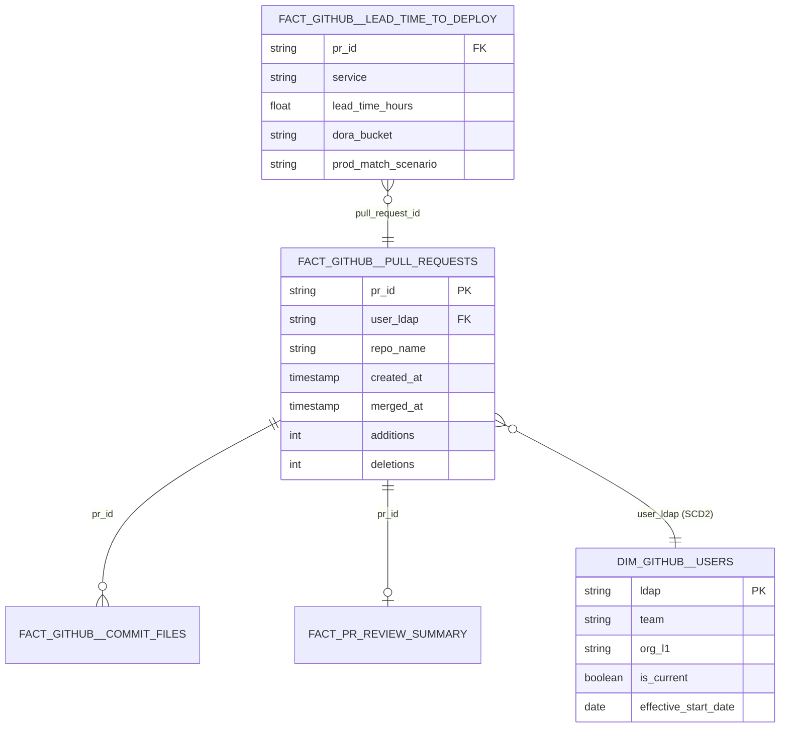

<div align="center">


<br/>


</div>

<br/>

> **Hypothetical Showcase** — two independent approaches to engineering velocity and DORA metrics on GitHub data. All company names and credentials are fully anonymised.

---

## ◈ Architecture



Both approaches produce identically-structured raw tables — all downstream dbt code is shared. The fork is purely in how data gets into Snowflake.

---

## ◈ Tech Stack

<div align="center">


</div>

---

## ◈ Credentials

All secrets are injected at runtime — no credentials in code or version control. See [CREDENTIALS.md](../CREDENTIALS.md) for key-pair setup, Cloud Secrets Managers, and CI/CD patterns.

**Approach 1 (Fivetran):** credentials are configured in the Fivetran UI — no secrets in this codebase.

**Approach 2 (Custom Pipeline) — Prefect Secret Blocks:**

```python
# Store once (run interactively or in a setup script)
import asyncio
from prefect.blocks.system import Secret

asyncio.run(Secret(value="ghp_xxxxxxxxxxxx").save("github-token"))
```

```python
# Reference in flow — value fetched at runtime, never logged or serialised
github_token = await Secret.load("github-token")
```

**Snowflake and GCS environment variables:**

```bash
# .env (never committed)
SNOWFLAKE_ACCOUNT=xy12345.us-east-1
SNOWFLAKE_USER=etl_user
SNOWFLAKE_PRIVATE_KEY_PATH=/path/to/rsa_key.p8
GCS_BUCKET=your-github-insights-bucket
GOOGLE_APPLICATION_CREDENTIALS=/path/to/service-account.json
```

Snowflake uses **key-pair auth**. GCS uses a service account JSON — reference its path via `GOOGLE_APPLICATION_CREDENTIALS`, which the GCS client library reads automatically.

---

## ◈ Two Ingestion Approaches

| | Approach 1 — Fivetran | Approach 2 — Custom Pipeline |
|---|---|---|
| **Ingestion code** | None — configured in Fivetran UI | ~500 lines Python (Prefect + httpx + PyArrow) |
| **Raw table names** | `fivetran.github_org_a.pull_request` | `GITHUB_PIPELINES.RAW_TABLES.PULL_REQUEST` |
| **Metadata columns** | `_fivetran_synced`, `_fivetran_deleted` | `_ingested_at`, `_source_org`, `_batch_id` |
| **Sync frequency** | Fivetran plan (typically 1–24h) | Any — configurable, can run every 15 min |
| **Schema evolution** | Fivetran handles API changes | You update the PyArrow schema |
| **Cost model** | Fivetran licensing + MAR | Compute cost only |
| **Best for** | Low ops overhead | Cost control or custom schemas |

---

## ◈ Quick Start

### Approach 1 — Fivetran

```
1. Configure Fivetran connectors → see approach-1-fivetran/README.md
2. Run approach-1-fivetran/sql/union_connectors.sql
3. cd dbt-github-insights
   cp models/staging/github/_sources_fivetran.yml models/staging/github/_sources.yml
   dbt deps && dbt run && dbt test
```

### Approach 2 — Custom Pipeline

```
1. Deploy Prefect flow → see approach-2-custom-pipeline/README.md
2. Run the flow to populate GITHUB_PIPELINES.RAW_TABLES
3. cd dbt-github-insights
   cp models/staging/github/_sources_custom.yml models/staging/github/_sources.yml
   dbt deps && dbt run && dbt test
```

---

## ◈ What This Platform Measures

- **DORA Lead Time to Deploy** — first commit → staging → production (hours), SHA match with time-based fallback
- **DORA Change Frequency** — deployments per day/week by service
- **PR cycle time** — time to first review, approval, merge at P50/P75/P95
- **Review coverage** — % of PRs reviewed externally (not self-merged)
- **Code churn** — file-level change volume by language and service, lock-file noise filtered
- **Team benchmarking** — all metrics sliced by team, function, and org using SCD2 user dimension

---

## ◈ DORA Lead Time Pipeline

The 7-stage `lead_time_to_deploy.sql` pipeline resolves commits → PRs → deployments:

```
Stage 1  Pull commits from FACT_COMMIT_FILES (first_commit_at per PR)
Stage 2  Join to service registry (PR → service ownership)
Stage 3  Attempt SHA match: deployment_sha = commit_sha
Stage 4  Time-based fallback for unmatched commits (nearest deployment window)
Stage 5  Compute lead_time_hours = deploy_at − first_commit_at
Stage 6  Classify into DORA buckets: elite (<1h) / high (<24h) / medium (<1wk) / low (>1wk)
Stage 7  MERGE into LEAD_TIME_TO_DEPLOY target
```

`pct_sha_matched` is surfaced as a data quality KPI — low values indicate service registry gaps, not deployment failures.

---

## ◈ Data Model



**Why SCD Type 2 for users?** Engineers transfer teams. Without it, a PR from when someone was on Team A would be attributed to Team B after the move. SCD2 ensures point-in-time attribution is always accurate.

---

## ◈ Project Structure

```
github-insights/
├── approach-1-fivetran/
│   ├── README.md
│   └── sql/union_connectors.sql          Multi-org UNION BY NAME + QUALIFY dedup
├── approach-2-custom-pipeline/
│   ├── README.md
│   └── prefect_flows/
│       └── github_pr_ingestion_flow.py   GitHub API → GCS/S3 → Snowflake COPY+MERGE
├── sql-jobs/
│   ├── reporting_data_model.sql          FACT_PULL_REQUESTS, BRIDGE_GITHUB_LDAP
│   └── lead_time_to_deploy.sql           7-stage DORA pipeline
└── dbt-github-insights/
    └── models/
        ├── staging/github/               _sources_fivetran.yml / _sources_custom.yml
        ├── intermediate/                 int_github__pr_lifecycle, int_github__lead_time
        └── marts/
            ├── engineering_velocity/     fct_github__pull_requests, lead_time, dim_users
            └── code_quality/             fct_github__commit_files
```

---

---

<div align="center">

<a href="https://www.linkedin.com/in/derek-o-halloran/">
  
</a>&nbsp;
<a href="https://github.com/ohderek/business-intelligence-portfolio">
  
</a>&nbsp;
<a href="https://github.com/ohderek/data-engineering-portfolio">
  
</a>

<br/><br/>


</div>
