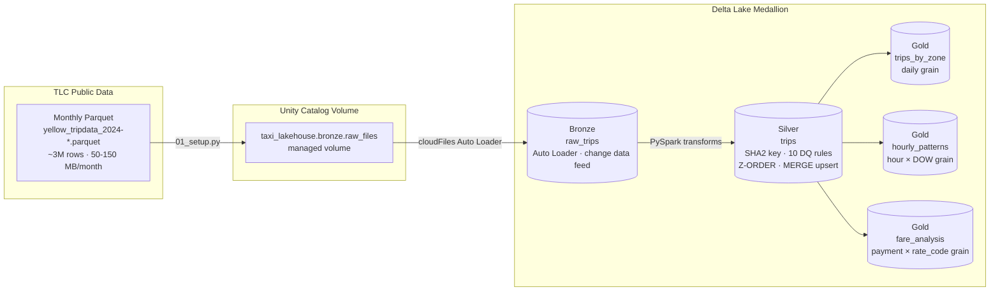

<div align="center">


<br/>


</div>

<br/>

> **Hypothetical Showcase** — production-grade lakehouse on the publicly available [NYC TLC Yellow Taxi dataset](https://www.nyc.gov/site/tlc/about/tlc-trip-record-data.page). No API key required — you can run this yourself on any Databricks workspace with Unity Catalog enabled.

---

## ◈ Architecture



Two deployment options: **notebook pipeline** (step-by-step, ideal for learning) and **Delta Live Tables** (production, automatic lineage and DQ). Both produce identical output.

---

## ◈ Quick Start

**Prerequisites:** Databricks workspace with Unity Catalog · Runtime 14.3+ · ~500 MB storage

```python
# Step 1 — Run sql/catalog_setup.sql in a Databricks SQL editor
# Creates: taxi_lakehouse catalog, bronze/silver/gold schemas, all DDL

# Step 2 — Open notebooks/01_setup.py on a cluster
# Set months_to_download = 1  (or up to 12)
# Downloads Parquet files from TLC CDN directly to your Volume

# Step 3 — Run the pipeline
# Option A: Notebook by notebook
#   01_setup.py → 02_bronze_ingest.py → 03_silver_transform.py → 04_gold_aggregations.py

# Option B: Delta Live Tables (production)
#   UI → Delta Live Tables → Create Pipeline
#   Source: dlt/taxi_pipeline.py  |  Target: taxi_lakehouse  |  Mode: Triggered

# Option C: Scheduled Workflow
databricks bundle deploy && databricks bundle run taxi_lakehouse_pipeline
```

---

## ◈ How It Works

### Bronze — Auto Loader Ingestion

Auto Loader (`cloudFiles`) tracks ingested files via checkpoint, so new monthly Parquet files added to the Volume are automatically picked up without reprocessing all 12 months.

```python
spark.readStream
     .format("cloudFiles")
     .option("cloudFiles.format", "parquet")
     .option("cloudFiles.schemaLocation", checkpoint_path)
     .schema(TRIPS_SCHEMA)                    # explicit — no inference scan
     .load(source_path)
```

`Trigger.AvailableNow` runs it as a controlled batch — processes all pending files, then stops. Two metadata columns are added: `_source_file` (which Parquet file the row came from) and `_ingested_at` (broker receipt time).

### Silver — Clean, Key, Validate

```python
# SHA2 surrogate key — deterministic, deduplicates across vendor sources
F.sha2(F.concat_ws("|", vendor_id, pickup_datetime, pu_location_id), 256)
```

Ten DQ rules are applied as **soft failures** — violating rows are flagged with `dq_valid=false` and `dq_flags` array, not dropped. Gold tables filter `dq_valid = true`. The full failure breakdown is queryable:

```sql
SELECT flag, COUNT(*) AS trip_count
FROM taxi_lakehouse.silver.trips
LATERAL VIEW explode(dq_flags) t AS flag
WHERE NOT dq_valid
GROUP BY 1 ORDER BY 2 DESC;
```

MERGE upsert on `trip_id` makes the Silver write idempotent — replaying Bronze data always produces the same Silver rows.

### Gold — Three Analytics Tables

| Table | Grain | Key metrics |
|---|---|---|
| `trips_by_zone` | pickup_zone × date | Trip count, avg fare, avg tip %, borough |
| `hourly_patterns` | hour × day_of_week | Volume index, weekday vs weekend split |
| `fare_analysis` | payment_type × rate_code | Avg/median/P95 fare, tip %, % of total trips |

Gold uses `OVERWRITE` mode — each run creates a new Delta version. Delta time travel makes every previous snapshot queryable:

```sql
-- Compare this week's top zones to last month's
SELECT * FROM taxi_lakehouse.gold.trips_by_zone
TIMESTAMP AS OF CURRENT_TIMESTAMP - INTERVAL 30 DAYS
WHERE pu_borough = 'Manhattan'
ORDER BY trip_count DESC LIMIT 10;
```

---

## ◈ Key Design Decisions

| Decision | Rationale |
|---|---|
| Auto Loader over `COPY INTO` | File-level checkpoint prevents reprocessing; `Trigger.AvailableNow` gives batch semantics without a persistent stream |
| Explicit `StructType` schema | Schema inference reads a sample of every file — expensive at scale. Prevents silent drift if TLC changes column types. |
| SHA2 surrogate key | `(VendorID, tpep_pickup_datetime, PULocationID)` deduplicates across vendor sources; hash is deterministic so replay is safe |
| Soft DQ failures (flag, don't drop) | Analysts choose to include or exclude flagged data. Quarantine pattern (DLT) tracks violations in event log without stopping the pipeline. |
| `Z-ORDER BY (pu_location_id, pickup_datetime)` | Co-locates rows by location on the same file groups — 60–80% scan reduction on location-filtered queries |
| Gold `OVERWRITE` + time travel | Each run is a clean snapshot; full history available via Delta versioning without managing SCD logic |

### DLT Expectations (quarantine pattern)

```python
@dlt.expect_all_or_drop({
    "valid_duration": "trip_duration_minutes > 0 AND trip_duration_minutes <= 1440",
    "valid_distance": "trip_distance_miles >= 0 AND trip_distance_miles <= 500",
    "valid_fare":     "fare_amount >= 0 AND fare_amount <= 1000",
})
def trips():
    ...
```

Violating rows are silently quarantined to the DLT system table. Tracked in the event log — doesn't stop the pipeline or corrupt the Silver table.

---

## ◈ Sample Output

**Top 10 pickup zones (1 month):**

| Zone | Borough | Trips | Avg Fare |
|---|---|---|---|
| Midtown Center | Manhattan | 187,429 | $16.40 |
| Upper East Side North | Manhattan | 143,210 | $14.20 |
| JFK Airport | Queens | 124,330 | $58.90 |
| Times Sq/Theatre District | Manhattan | 118,752 | $15.10 |
| LaGuardia Airport | Queens | 98,213 | $31.50 |

**Tip rate by payment type:**

| Payment Type | Trips | Avg Fare | Avg Tip % |
|---|---|---|---|
| Credit Card | 2,134,819 | $16.80 | 22.4% |
| Cash | 891,204 | $14.20 | 0.0% |

---

## ◈ Tech Stack

<div align="center">


</div>

---

<div align="center">

<a href="https://www.linkedin.com/in/derek-o-halloran/">
  
</a>&nbsp;
<a href="https://github.com/ohderek/data-engineering-portfolio">
  
</a>

<br/><br/>


</div>
