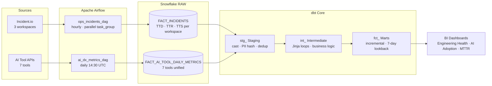

<div align="center">


<br/>


</div>

<br/>

> **Hypothetical Showcase** — operational health metrics for incident management, AI developer experience, and SLO tracking. All company names and credentials are fully anonymised.

---

## ◈ Architecture



Data flows from three Incident.io workspaces and seven AI tool APIs through Airflow ETL into Snowflake RAW, then transformed by dbt into analyst-facing mart tables. A Jinja loop in the intermediate layer means adding a fourth workspace or eighth tool is a one-line change.

---

## ◈ Quick Start

**Prerequisites:** Python 3.11+ · Apache Airflow 2.9 · dbt-snowflake · Snowflake account

```bash
# Airflow setup
pip install apache-airflow==2.9.0 apache-airflow-providers-snowflake requests pandas
cp etl-pipelines/dags/*.py $AIRFLOW_HOME/dags/
airflow variables set INCIDENT_IO_API_KEY "your-key"

# dbt setup
pip install dbt-snowflake
cp dbt-operational-performance/profiles.yml ~/.dbt/profiles.yml
cd dbt-operational-performance
dbt deps && dbt run --select staging
dbt run --select intermediate
dbt run --select marts
dbt test
```

---

## ◈ ETL Pipelines — `etl-pipelines/`

### Framework Components (`src/`)

| Class | Purpose |
|---|---|
| `BaseExtractor` | Abstract base — extraction contract with retry/backoff, watermark-based incremental logic, batch iterator. Subclass to add any new source. |
| `APIExtractor` | Concrete REST extractor — `requests.Session` with retry adapter, auth headers from env vars, cursor/offset/page pagination |
| `DataTransformer` | Schema enforcement — validates required fields, coerces types, logs schema drift, raises `SchemaValidationError` on NULL violations |
| `SnowflakeLoader` | Idempotent loader — `write_pandas` to staging, `MERGE INTO` target, truncate stage. Re-running the same data is always safe. |

### `ops_incidents_dag.py` — hourly

Extracts from all three Incident.io workspaces in parallel via `@task_group`. Each workspace has its own watermark tracking `last_updated_at` — a failure in one doesn't reset the others.

```python
# Per-workspace TTD/TTR/TTS computed in Python before load
# Avoids epoch arithmetic in Snowflake SQL
event["ttd_sec"] = (detected_at - created_at).total_seconds()
event["ttr_sec"] = (resolved_at - detected_at).total_seconds()
event["tts_sec"] = (resolved_at - created_at).total_seconds()
```

### `ai_dx_metrics_dag.py` — daily 14:30 UTC

Pulls token usage and session counts from 7 AI tools (LLM gateway for Claude/GPT/Gemini, IDE tools like Cursor/Amp, chat tools). Tools don't always report raw token counts — estimation constants bridge the gap:

| Tool | Estimation method |
|---|---|
| Claude Code | 7,500 tokens/request |
| IDE completions | 15 tokens/line accepted |
| Chat sessions | reported tokens (where available) |

---

## ◈ dbt Project — `dbt-operational-performance/`

### Staging

One model per source/entity. Thin wrappers: cast types, rename to `snake_case`, hash PII, dedup. Each Incident.io workspace has slightly different field names — each gets its own staging model that normalises to a canonical schema.

| Model | Workspace quirk handled |
|---|---|
| `stg_incident_io__companya__incidents` | `impact_start` field (not `detected_at`) |
| `stg_incident_io__companyb__incidents` | `identified_at` → mapped to `detected_at` |
| `stg_incident_io__companyc__incidents` | No `fixed_at` column — defaults to NULL |

### Intermediate — Jinja Loop Pattern

The key reuse pattern in this project. Adding a 4th workspace requires one line:

```sql
-- int_ops__incidents_unioned.sql



    SELECT *, '{{ instance }}' AS workspace
    FROM {{ ref('stg_incident_io__' ~ instance ~ '__incidents') }}
     UNION ALL 

```

Same pattern used in `int_ai_telemetry__tool_daily_metrics` over 7 AI tools.

### Marts

| Model | Strategy | Notes |
|---|---|---|
| `fct_ops__incidents` | `incremental · merge` | `CLUSTER BY incident_date` · dynamic warehouse sizing |
| `bridge_ops__incident_service` | `table` | M:M incident → service with `HASHDIFF` change detection |
| `fct_ai_telemetry__tool_daily_metrics` | `incremental` | Daily per-engineer AI tool usage |
| `fct_ai_telemetry__weekly_eng_ai_tokens` | `table` | P50/P75/P95 token estimates per engineer |

**7-day lookback buffer** on all incremental models: incidents are updated days after resolution. Without the buffer, late updates would be missed.

### Macros

| Macro | What it does |
|---|---|
| `generate_schema_name` | In `prod`: target schema. In `dev`: `sandbox_{user}_` prefix. Prevents dev from overwriting production. |
| `hash_pii` | `SHA2(LOWER(TRIM(col)), 256)` at staging — raw PII never propagates to marts |
| `safe_divide` | `IFF(denominator = 0, NULL, numerator / denominator)` — zero-safe ratios throughout |
| `date_spine_filter` | Date spine CTE for gap-filling time-series facts |

---

## ◈ Key Design Patterns

| Pattern | Where | Why |
|---|---|---|
| Jinja loop over instances | `int_ops__incidents_unioned`, `int_ai_telemetry__*` | One-line change to add a workspace or tool |
| Stage-and-merge | All Airflow loaders | Idempotent — safe to re-run on failure without duplicates |
| 7-day incremental lookback | All mart models | Catches late-arriving incident updates without full scans |
| `generate_schema_name` macro | dbt project | Each developer works in isolated `sandbox_{user}` schema |
| PII hashing at staging | `stg_*` models | Raw values never reach marts or BI tools |
| Dynamic warehouse sizing | Mart configs | `ETL_SMALL` for incremental, `ETL_MEDIUM` for full refresh — right-size compute |

---

## ◈ Tech Stack

<div align="center">


</div>

---

<div align="center">

<a href="https://www.linkedin.com/in/derek-o-halloran/">
  
</a>&nbsp;
<a href="https://github.com/ohderek/data-engineering-portfolio">
  
</a>

<br/><br/>


</div>
