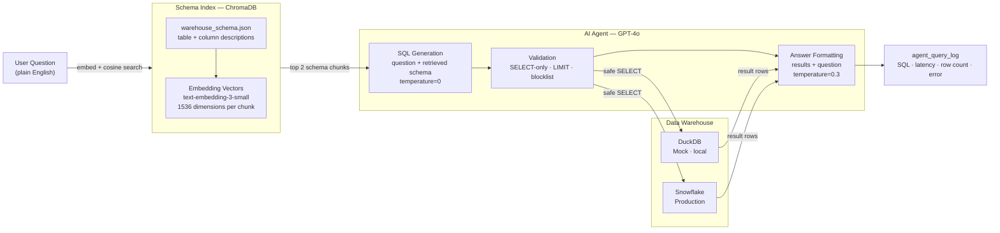

<div align="center">


<br/>


</div>

<br/>

> **Hypothetical Showcase** — production-grade Retrieval-Augmented Generation (RAG) pipeline over an enterprise data warehouse. Ask a business question in plain English; the agent finds the right tables, generates SQL, executes it, and returns a direct answer with the query included for transparency.

---

## ◈ What This Is

Most BI tools require users to know SQL, know which tables exist, and know what the columns mean. This agent removes all three requirements.

You ask: *"Which acquisition channel produces the highest lifetime value customers?"*
The agent returns an answer, the SQL it ran, and how long it took — in about 3 seconds.

The hard parts this project solves:

| Problem | Solution |
|---|---|
| Warehouse has 100s of tables — can't paste all into an LLM prompt | RAG: embed the schema, retrieve only relevant tables per question |
| LLMs hallucinate column names | Grounding: retrieved schema chunks are injected verbatim into the prompt |
| AI + database = risk of destructive queries | Validator: SELECT-only enforcement, LIMIT injection, keyword blocklist |
| Hard to improve an AI system you can't measure | Observability: every interaction logged to `agent_query_log` |
| Needs a Snowflake account to demo | Mock mode: DuckDB runs locally with realistic seeded data |

---

## ◈ Architecture



---

## ◈ Tech Stack

<div align="center">


</div>

---

## ◈ Credentials

Only one credential is required to run this project: an **OpenAI API key**.

```bash
# .env  (never committed — .gitignore includes this file)
OPENAI_API_KEY=sk-...

# Everything else defaults to mock/local mode
USE_MOCK_DB=true
```

**Cost estimate:** ~$0.01 per 100 questions at default settings (text-embedding-3-small + GPT-4o). Switch `CHAT_MODEL=gpt-4o-mini` in `.env` to reduce this by ~20×.

**Production Snowflake:** set `USE_MOCK_DB=false` and add Snowflake credentials to `.env`. See [CREDENTIALS.md](../CREDENTIALS.md) for key-pair auth (recommended over password for production). No code changes required — the same codebase runs against both backends.

```bash
# .env additions for Snowflake mode
USE_MOCK_DB=false
SNOWFLAKE_ACCOUNT=xy12345.us-east-1
SNOWFLAKE_USER=svc_agent
SNOWFLAKE_PASSWORD=...            # or use key-pair — see CREDENTIALS.md
SNOWFLAKE_DATABASE=ANALYTICS
SNOWFLAKE_SCHEMA=MARTS
```

---

## ◈ Quick Start

**Prerequisites:** Python 3.10+ · OpenAI API key

```bash
# 1. Clone and install dependencies
pip install -r requirements.txt

# 2. Copy env file and add your OpenAI key
cp .env.example .env
# edit .env: set OPENAI_API_KEY=sk-...

# 3. Seed the local database (~12,500 rows of mock e-commerce + ops data)
make seed

# 4. Start the API server
make start
# → Running at http://localhost:8000
# → Interactive docs at http://localhost:8000/docs

# 5. In a second terminal, test it:
make test
```

**Sample response:**

```json
{
  "question": "What is total revenue by region?",
  "sql": "SELECT region, SUM(net_line_amount) AS total_revenue, COUNT(*) AS order_count FROM fct_finance__revenue WHERE status = 'completed' GROUP BY region ORDER BY total_revenue DESC LIMIT 500",
  "answer": "Total revenue by region shows us-east leading with ~$2.1M (35% of total), followed by us-west at ~$1.5M. The ap-southeast region has the lowest volume at ~$480K, consistent with the weighted customer distribution. eu-west and eu-central together account for roughly 32% of total revenue.",
  "row_count": 5,
  "latency_ms": 2840.1,
  "schema_tables_used": ["fct_finance__revenue"]
}
```

---

## ◈ How It Works

### Step 1 — Schema Indexing (runs once on startup)

The agent needs to know what tables and columns exist in your warehouse.
Instead of reading a database catalogue, it reads `schemas/warehouse_schema.json`
— a structured file you maintain (similar to dbt model descriptions).

**What is an embedding?**

An embedding is a list of numbers (a "vector") that encodes the *meaning* of a piece of text. OpenAI's `text-embedding-3-small` produces 1,536 numbers per text chunk. Two chunks with similar meaning produce similar vectors.

```
"total revenue by region"    → [0.21, -0.43, 0.08, ...]   <- similar
"sales breakdown per area"   → [0.19, -0.41, 0.09, ...]   <- similar ↑
"number of open incidents"   → [-0.31, 0.52, -0.14, ...]  <- different
```

Each table in the schema gets embedded as one chunk (table name + description + all column descriptions). ChromaDB stores these vectors on disk (`./chroma_db/`).

On subsequent restarts, ChromaDB loads from disk — no re-embedding, instant startup.

```python
# src/schema_indexer.py — simplified view of what happens
collection.add(
    ids=["fct_finance__revenue", "dim_marketing__customers", ...],
    documents=["Table: fct_finance__revenue\nDescription: ...\nColumns: ..."],
)
```

---

### Step 2 — Query Time: Retrieve Relevant Schema

When a question arrives, the agent embeds it (one API call) and asks ChromaDB: *"which stored schema chunks are most similar to this question vector?"*

This is **cosine similarity** — it measures the angle between two vectors. An angle near 0° means very similar; near 90° means unrelated.

```python
# src/schema_indexer.py
results = collection.query(
    query_texts=["What is total revenue by region?"],
    n_results=2,   # retrieve top 2 most relevant tables
)
# Returns: fct_finance__revenue (closest match), dim_marketing__customers (second)
```

Only those 2 schema chunks are passed to the LLM — not the entire catalogue.
This is why the approach scales: adding 500 more tables doesn't slow down retrieval or increase token cost.

---

### Step 3 — SQL Generation

The retrieved schema chunks and the user's question are assembled into a prompt for GPT-4o.

**What is a prompt?**
A prompt is the instruction you give to an LLM — like a very precise brief.
The quality of the SQL output is almost entirely determined by prompt quality.

Key prompt decisions in `src/sql_agent.py`:

| Choice | Reason |
|---|---|
| `temperature=0` | SQL must be deterministic — same question, same SQL |
| "Output ONLY the SQL, no explanation, no markdown" | Stops the model adding code fences that break parsing |
| LIMIT injected into the instructions | Belt-and-suspenders against missing LIMIT |
| CANNOT_ANSWER sentinel | Gives the model an escape hatch so it doesn't hallucinate table names |

```python
# The prompt template (simplified)
"""
You are an expert DUCKDB SQL analyst.
Write a SELECT query to answer the question.
Output ONLY the SQL — no explanation, no code fences.
If you cannot answer from the schema, output: CANNOT_ANSWER

SCHEMA CONTEXT:
Table: fct_finance__revenue
Description: Grain: one row per order line item...
Columns:
  - net_line_amount (FLOAT): actual revenue recognised
  - region (VARCHAR): us-east, us-west, eu-west...
  ...

USER QUESTION: What is total revenue by region?

SQL QUERY:
"""
```

---

### Step 4 — Validation

The generated SQL goes through `src/sql_validator.py` before touching the database.
Three checks, all of which must pass:

```
1. ALLOWLIST   → first keyword must be SELECT or WITH
2. BLOCKLIST   → DROP, DELETE, TRUNCATE, INSERT, CREATE... all rejected
3. LIMIT CHECK → if missing, inject LIMIT 500 automatically
```

If any check fails, the query is rejected with a clear error. The database is never reached.

Why both allowlist AND blocklist?
- Allowlist alone could be bypassed by a crafted nested query
- Blocklist alone might miss novel patterns
- Together they cover known and unknown attack surfaces

---

### Step 5 — Execution

The validated SQL runs against DuckDB (mock) or Snowflake (production).
Both return `List[Dict]` — identical interface.

```python
# Both modes: same result format
[
    {"region": "us-east",      "total_revenue": 2134819.42, "order_count": 3521},
    {"region": "us-west",      "total_revenue": 1508204.11, "order_count": 2489},
    {"region": "eu-west",      "total_revenue":  897341.08, "order_count": 1632},
    ...
]
```

---

### Step 6 — Answer Formatting

A second LLM call turns the result rows into a plain-English answer.

Why a second call rather than asking for SQL + answer in one?

1. **Debuggability** — if the answer is wrong, you can inspect the SQL independently
2. **Cost control** — the formatting call can use a cheaper model (`gpt-4o-mini`)
3. **Specialisation** — one call optimised for correctness (SQL), one for clarity (prose)

```python
# src/sql_agent.py — the formatting prompt (simplified)
"""
You are a data analyst writing a concise summary for a business stakeholder.
Lead with the direct answer. Include specific numbers. Keep it under 150 words.

QUESTION: What is total revenue by region?
SQL RUN:  SELECT region, SUM(net_line_amount)...
RESULTS:  [{"region": "us-east", "total_revenue": 2134819.42}, ...]

ANSWER:
"""
```

---

### Step 7 — Logging

Every interaction is written to `agent_query_log`:

```sql
-- Query agent performance over time
SELECT
    DATE_TRUNC('day', created_at)                            AS day,
    COUNT(*)                                                  AS total_queries,
    COUNT(*) FILTER (WHERE error IS NOT NULL)                 AS failed,
    ROUND(AVG(latency_ms))                                    AS avg_latency_ms,
    LIST(tables_used) FILTER (WHERE error IS NOT NULL)        AS failed_table_retrievals
FROM agent_query_log
GROUP BY 1
ORDER BY 1 DESC;
```

Low `pct_sha_matched` in the retrieval tells you the schema descriptions need improving — not that the model is bad.

---

## ◈ The Schema File

`schemas/warehouse_schema.json` is the agent's knowledge base.
The more descriptive the text, the better the retrieval accuracy.

**Adding a new table:**

```json
{
  "name": "fct_marketing__campaigns",
  "description": "Grain: one row per campaign per day. Tracks ad spend, impressions, clicks, and attributed revenue. Use this for ROI, CAC, and campaign performance questions.",
  "columns": [
    {"name": "campaign_id",        "type": "VARCHAR", "description": "Unique campaign identifier"},
    {"name": "campaign_date",      "type": "DATE",    "description": "Day of campaign activity"},
    {"name": "channel",            "type": "VARCHAR", "description": "paid_search, social, display, email"},
    {"name": "spend_usd",          "type": "FLOAT",   "description": "Ad spend in USD for this day"},
    {"name": "attributed_revenue", "type": "FLOAT",   "description": "Revenue attributed to this campaign"}
  ],
  "sample_questions": [
    "What is our return on ad spend by channel?",
    "Which campaign has the best revenue-to-spend ratio?"
  ]
},
```

After adding a table: `make index` to rebuild the ChromaDB index. Then restart the server.

---

## ◈ Key Design Decisions

| Decision | Rationale |
|---|---|
| One embedding per table, not per column | Keeps related columns together so retrieved context is self-contained — a column isolated from its table description gives the LLM incomplete information |
| `temperature=0` for SQL, `0.3` for prose | SQL correctness requires determinism; natural language benefits from slight variation to avoid robotic repetition |
| Two LLM calls instead of one | Separation of concerns — SQL failures and formatting failures are independently debuggable; formatting can use a cheaper model |
| ChromaDB not Snowflake Cortex | Runs locally with zero infrastructure; Snowflake Cortex vector search is the production equivalent — same pattern, just a different backend |
| DuckDB for mock mode | Full SQL support (CTEs, window functions, date arithmetic) on the same queries that run in Snowflake — not a toy simulator |
| Blocklist AND allowlist validation | Two independent safety layers; neither alone is sufficient; belt-and-suspenders is the correct posture for AI + production database |
| Log to same database as data | No external observability platform needed; agent performance queryable with the same SQL tools used for everything else |

---

---

<div align="center">

<a href="https://www.linkedin.com/in/derek-o-halloran/">
  
</a>&nbsp;
<a href="https://github.com/ohderek/data-engineering-portfolio">
  
</a>

<br/><br/>


</div>
