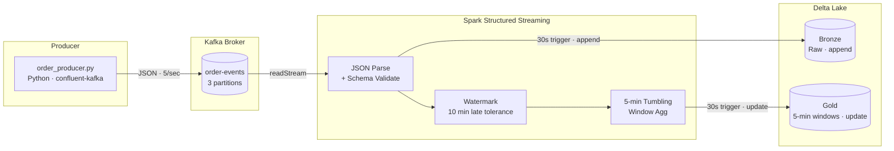

<div align="center">


<br/>


</div>

<br/>

---

## ◈ Architecture



The producer simulates an e-commerce order feed. Spark consumes it via Structured Streaming and writes two Delta tables: **Bronze** captures every raw event for audit and replay; **Gold** maintains 5-minute tumbling-window aggregations for real-time revenue monitoring. Both queries run concurrently with independent checkpoints.

---

## ◈ Tech Stack

<div align="center">


</div>

---

## ◈ Credentials

**Local dev:** no external credentials required — Kafka runs entirely inside Docker.

**Production Kafka** (Confluent Cloud / Amazon MSK / self-hosted with SASL): inject broker credentials via environment variables, never in source code or `docker-compose.yml`:

```bash
# .env (never committed)
KAFKA_BOOTSTRAP_SERVERS=pkc-xxxx.us-east-1.aws.confluent.cloud:9092
KAFKA_SASL_USERNAME=your-api-key
KAFKA_SASL_PASSWORD=your-api-secret
```

```python
# spark/streaming_consumer.py — production Kafka config
(
    spark.readStream
    .format("kafka")
    .option("kafka.bootstrap.servers",    os.environ["KAFKA_BOOTSTRAP_SERVERS"])
    .option("kafka.security.protocol",    "SASL_SSL")
    .option("kafka.sasl.mechanism",       "PLAIN")
    .option("kafka.sasl.jaas.config",
        f"org.apache.kafka.common.security.plain.PlainLoginModule required "
        f"username='{os.environ[\"KAFKA_SASL_USERNAME\"]}' "
        f"password='{os.environ[\"KAFKA_SASL_PASSWORD\"]}';")
    ...
)
```

For managed Spark (Databricks / EMR), store the SASL credentials in the cluster's secret scope (Databricks Secrets or AWS Secrets Manager) and reference them via `dbutils.secrets.get()` or SSM — not as plain environment variables on shared compute. See [CREDENTIALS.md](../CREDENTIALS.md) for Cloud Secrets Manager patterns.

---

## ◈ Quick Start

**Prerequisites:** Docker · Python 3.10+ · Java 11+ · Apache Spark 3.5 (`spark-submit` in PATH)

```bash
# Terminal 1 — start Kafka (broker + UI)
make start

# Terminal 2 — publish 5 order events/sec
make produce

# Terminal 3 — start the Spark Structured Streaming job
# (resolves Maven packages on first run, ~2 min)
make consume
```

Open **http://localhost:8080** (Kafka UI) to browse the `order-events` topic in real time.

After ~60 seconds, Delta tables appear under `./delta/`:

```
./delta/
  bronze/order_events/          ← raw events, partitioned by event_date
  gold/order_revenue_windows/   ← 5-min window aggregations

./checkpoints/
  bronze/                       ← Kafka offset cursor for Bronze query
  gold/                         ← Kafka offset cursor for Gold query
```

To restart from scratch (clear state and replay from latest Kafka offset):

```bash
make clean && make consume
```

---

## ◈ How It Works

### 1. Producer — `producer/order_producer.py`

Generates JSON events for 8 products across 5 regions. Three design choices worth noting:

| Choice | Rationale |
|---|---|
| `order_id` as Kafka partition key | All events for a single order land on the same partition, preserving per-order ordering |
| ±15% price variance | Mimics real-world dynamic pricing and promotions — keeps aggregations non-trivial |
| Weighted region distribution | us-east 35%, us-west 25%, eu-west 20% — mirrors realistic traffic skew |

Publish rate is configurable: `make produce RATE=50` for load testing.

---

### 2. Streaming Consumer — `spark/streaming_consumer.py`

#### Source

```python
spark.readStream
    .format("kafka")
    .option("subscribe",            "order-events")
    .option("startingOffsets",      "latest")      # first run only
    .option("maxOffsetsPerTrigger", 10_000)        # cap batch size
```

`startingOffsets=latest` applies only to the very first run. On all subsequent restarts, Spark reads the committed Kafka offset from the checkpoint directory and resumes exactly where it left off — **no data loss, no duplicates**.

#### Parse

```python
F.from_json(F.col("value").cast("string"), ORDER_EVENT_SCHEMA)
```

Explicit schema is faster than inferred (no scan required) and enforces the producer–consumer contract. Malformed events land with NULL fields and are filtered before they reach any sink.

#### Bronze — append, 30s micro-batches

Every valid event is appended as-is, partitioned by `event_date`. This layer is the source of truth for auditing, backfilling downstream models, and debugging parsing failures against the original payload.

#### Gold — 5-minute tumbling windows, update mode

```python
events_df
    .filter(F.col("event_type") == "ORDER_PLACED")   # revenue only
    .withWatermark("event_timestamp", "10 minutes")  # late-data tolerance
    .groupBy(
        F.window("event_timestamp", "5 minutes"),
        "region",
        "product_category",
    )
    .agg(
        F.count("order_id"),
        F.sum("total_price"),
        F.avg("total_price"),
        F.countDistinct("customer_id"),
    )
```

Windowing is on `event_timestamp` (the business time in the payload), not the Kafka broker timestamp. This gives correct results even when the producer is slow or batches events — a common production failure mode.

---

### 3. Output Layers — Data Model

**Bronze** — `./delta/bronze/order_events`

| Column | Type | Notes |
|---|---|---|
| `order_id` | string | UUID, partition key from Kafka |
| `customer_id` | string | |
| `product_id` | string | |
| `product_name` | string | |
| `product_category` | string | Electronics · Apparel · Sports · Home · Health · Appliances |
| `quantity` | int | |
| `unit_price` | double | ±15% variance from base price |
| `total_price` | double | unit_price × quantity |
| `event_type` | string | ORDER_PLACED · ORDER_CANCELLED · ORDER_UPDATED |
| `region` | string | us-east · us-west · eu-west · eu-central · ap-southeast |
| `event_timestamp` | timestamp | Business time embedded in payload |
| `kafka_ingest_ts` | timestamp | Broker receipt time — for lag monitoring |
| `kafka_partition` | int | |
| `kafka_offset` | long | |
| `event_date` | date | Partition column |

**Gold** — `./delta/gold/order_revenue_windows`

| Column | Type | Notes |
|---|---|---|
| `window_start` | timestamp | Start of 5-min tumbling window |
| `window_end` | timestamp | End of 5-min tumbling window |
| `region` | string | |
| `product_category` | string | |
| `order_count` | long | ORDER_PLACED events only |
| `total_revenue` | double | |
| `avg_order_value` | double | |
| `total_units_sold` | long | |
| `unique_customers` | long | COUNT DISTINCT within window |

---

## ◈ Key Concepts

### Event Time vs Processing Time

Windowing is on `event_timestamp` — the time the order was placed — not the time Kafka received it or Spark processed it. A network hiccup or producer batch delay doesn't shift the window boundary.

### Watermarking and Late Data

```
Watermark = max(event_timestamp seen so far) − 10 minutes
```

Events older than the watermark are dropped. Windows are not finalised until the watermark passes `window_end`. The 10-minute tolerance means:
- A window covering 14:00–14:05 stays open until ~14:15
- State for that window is held in memory until then, then evicted
- Trade-off: wider watermark = more complete data, more memory

### Output Modes

| Mode | When to use |
|---|---|
| `append` | No aggregations, or aggregations with watermark where each row is final |
| `update` | Aggregations — only changed rows written per batch (efficient) |
| `complete` | Aggregations — entire result rewritten every batch (use with caution) |

Gold uses `update` mode. Each micro-batch writes only the window rows that changed, making Delta MERGE semantics the correct engine choice.

### Checkpointing and Exactly-Once

Spark writes the committed Kafka offset to `./checkpoints/` after each successful micro-batch. On restart, it reads that offset and resumes from the exact next message. Combined with Delta Lake's atomic writes, this gives end-to-end exactly-once semantics.

---

## ◈ Querying the Output

```python
from pyspark.sql import SparkSession

spark = SparkSession.builder \
    .config("spark.sql.extensions", "io.delta.sql.DeltaSparkSessionExtension") \
    .config("spark.sql.catalog.spark_catalog", "org.apache.spark.sql.delta.catalog.DeltaCatalog") \
    .getOrCreate()

# Bronze
spark.read.format("delta").load("./delta/bronze/order_events") \
     .createOrReplaceTempView("bronze_order_events")

# Gold
spark.read.format("delta").load("./delta/gold/order_revenue_windows") \
     .createOrReplaceTempView("gold_order_revenue_windows")

# Then run queries from queries/bronze_check.sql and queries/gold_revenue.sql
```

---

---

<div align="center">

<a href="https://www.linkedin.com/in/derek-o-halloran/">
  
</a>&nbsp;
<a href="https://github.com/ohderek/data-engineering-portfolio">
  
</a>

<br/><br/>


</div>
